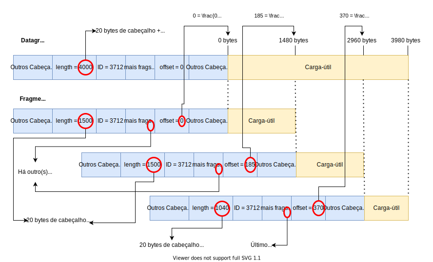

Fragmentação é o processo pelo qual um datagrama **grande** é quebrado
em uma sequência de datagramas menores. No IPv4 a fragmentação *pode
ocorrer* nos roteadores intermediários pelos quais um datagrama passa.

## Motivos para a Fragmentação

Para entender a razão pela qual a fragmentação existe, é preciso
voltarmos uma vez mais às características básicas da Internet. Em
particular, devemos lembrar que a Internet foi pensada como uma rede que
pudesse ser executada sobre uma grande variedade de tecnologias de
enlace diferentes, com o protocolo IP provendo a interface padronizada
que garantiria a intercomunicação. Ocorre que tecnologias de enlaces de
comunicação baseadas em comutação de pacotes normalmente definem um
**tamanho máximo** para os pacotes transmitidos pelos seus enlaces --- o
Ethernet, por exemplo, coloca este limite em 1514 bytes. Além disso,
tecnologias diferentes muitas vezes estabelecem limites distintos ---
por exemplo, o Wi-Fi permite a transmissão de pacotes de até 2346 bytes.

Esta variabilidade dos limites de tamanho dos pacotes transmitidos por
cada enlace cria o seguinte dilema: qual é o tamanho máximo de um
datagrama gerado por um determinado *host* de origem? O *host* poderia
verificar o limite da sua própria interface, e utilizar este valor para
balizar o tamanho máximo dos seus datagramas. Mas isso não garante que,
ao longo do caminho até o destinatário final, este datagrama não
precisará passar por um enlace mais restritivo. Se isso acontecer, o que
o roteador intermediário deverá fazer?

É justamente neste ponto que entra a fragmentação. Se um roteador
intermediário precisa encaminhar um datagrama grande demais por um certo
enlace de saída restritivo, ele pode quebrar o datagrama original em
fragmentos menores --- que respeitem o limite de tamanho imposto pelo
enlace --- e transmiti-los um a um. Cada fragmento é, na verdade, um
novo datagrama IP, no sentido de que cada datagrama conterá seu próprio
cabeçalho e será encaminhado de maneira independente dos demais
fragmentos do datagrama original --- *e.g.*, um fragmento pode ser
perdido, enquanto os demais são entregues ao destinatário final, ou
mesmo encaminhado por um caminho diferente dos outros fragmentos.

## Remontagem 

O processo inverso à fragmentação é comumente chamado de *remontagem*,
no qual os fragmentos de um datagrama são juntados para formar novamente
um datagrama idêntico ao original. É importante ressaltar que no IPv4
**a remontagem é realizada apenas pelo destinatário final**. Em outras palavras, independentemente do tamanho máximo dos pacotes transmitidos pelo seu enlace de saída, um roteador intermediário nunca irá remontar um datagrama fragmentado em um salto anterior do caminho. Uma das
justificativas para esta escolha tem relação com a complexidade
associada ao processo de remontagem, associada à filosofia de manter a
inteligência nas bordas na Internet.

## MTU

No protocolo IP, o tamanho máximo de um datagrama --- **incluindo o
cabeçalho IP** --- que pode ser transmitido por um determinado enlace recebe o
nome de MTU (*Maximum Transmission Unit*). Ao tentar encaminhar um
datagrama por um enlace de saída, um roteador deve comparar seu
comprimento total ao MTU do enlace. Se o datagrama é maior que o MTU,
efetua-se a fragmentação.

## Como Fragmentar um Datagrama?

Para fragmentar um datagrama, o IP utiliza três campos específicos de
seu cabeçalho: o campo de identificação, o campo de *offset* do
fragmento e a *flag* *mais fragmentos*.

O campo de identificação é usado para informar ao receptor que certo
conjunto de fragmentos fazem parte de um mesmo datagrama original.
Basicamente, ao fragmentar um datagrama, o roteador deve incluir o mesmo
identificador do datagrama original em todos os fragmentos resultantes. Lembre-se que o valor desse campo no datagrama original é preenchido pelo *host* de origem de forma similar a um número de sequência. Assim, espera-se que datagramas originados por um mesmo *host* em momentos próximos possuam identificadores diferentes, de forma que seus respectivos fragmentos --- se houver necessidade --- sejam facilmente identificáveis.

O campo *offset* do fragmento armazena a posição que a carga útil do
fragmento ocupa dentro da carga útil do datagrama original. Se pensarmos
na carga útil de um datagrama original como um vetor de bytes, o
*offset* de um fragmento diz qual índice deste vetor corresponde ao
primeiro byte da carga útil do fragmento. Um detalhe sobre este campo é
que, para permitir *offsets* grandes com um campo relativamente pequeno
--- este campo possui 13 bits --- o valor do *offset* é contado em
*palavras de 8 bytes*. Por exemplo, se o valor do campo *offset* é 10,
isso significa que o primeiro byte da carga útil do fragmento
corresponde ao byte de índice $10\times 8 = 80$ na carga útil do
datagrama original.

Finalmente, a *flag* *mais fragmentos* indica se o fragmento é o último
do datagrama original. Se o bit desta *flag* tiver valor 0, este
fragmento é o último. Caso contrário, ainda há outros fragmentos após
este.

O campo *offset* é fundamental para que o receptor possa saber como ---
em que ordem --- remontar os fragmentos no datagrama original, já que a
Internet pode entregar datagramas --- e, portanto, fragmentos --- fora
de ordem. Já a *flag* *mais fragmentos* serve para indicar ao receptor
quando parar de esperar novos fragmentos.

Note que estes campos existem no cabeçalho IP, independentemente de se o
datagrama é original ou um fragmento. Para datagramas não fragmentados,
ambos o campo *offset* e a *flag* *mais fragmentos* devem ser iguais a
zero. Qualquer outra combinação indica que o datagrama é, na verdade, um
fragmento de um datagrama maior.

Ao realizar a fragmentação de um datagrama, é comum --- embora não
mandatório --- que o roteador gere os maiores fragmentos possíveis.
Assim, os $n$ primeiros fragmentos teriam comprimento total igual ao MTU
do enlace. Isso significa que esses $n$ primeiros fragmentos possuiriam uma carga útil com tamanho igual ao MTU do enlace subtraído do tamanho do cabeçalho IPv4[^MultiploDe8]. O último
fragmento, por sua vez, receberia o restante da carga útil.

[^MultiploDe8]: Na verdade, o tamanho da carga útil seria o maior múltiplo de 8 menor ou igual a esse valor. Isso porque o campo *offset* é contado em palavras de 8 bytes. Assim, com exceção do último, nenhum fragmento pode ter um tamanho que não seja um múltiplo de 8 bytes.

## Exemplo

Para que fique mais claro o processo de fragmentação de pacotes, vamos considerar um exemplo concreto ilustrado na figura abaixo:

{#ExemploFrag}

No topo da figura, há a representação de um datagrama original --- conforme gerado pelo *host* de origem. Esse datagrama possui 4000 bytes de **tamanho total**, *i.e.*, incluindo os cabeçalhos do próprio IPv4. Embora o tamanho de um cabeçalho IPv4 possa variar, por conta do campo opcional *opções*, para a maioria dos datagramas ele terá 20 bytes. É o caso desse exemplo, em que a carga-útil possui $4000 - 20 = 3980$ bytes.

Suponha que, em algum ponto do encaminhamento desse datagrama pela rede, haja a necessidade de transmiti-lo por um enlace com MTU de 1500 bytes. Nesse momento, será necessário fragmentá-lo em, pelo menos 3 fragmentos, conforme ilustrado na parte inferior da figura.

Assumindo que pretendemos gerar os maiores fragmentos possíveis, o primeiro terá **tamanho total** de 1500 bytes --- o valor do MTU do enlace. Desses, 20 bytes serão dedicados ao cabeçalho, enquanto os outros 1480 corresponderão aos primeiros 1480 bytes da carga-útil do datagrama original. Repare como o campo de identificação do fragmento recebe exatamente o mesmo ID do datagrama original. Além disso, o campo *offset* recebe o valor 0, indicando que a carga-útil do fragmento corresponde ao início da carga-util do datagrama original. Por fim, como ainda há pedaços da carga-útil original a fragmentar, devemos configurar a *flag* de *mais fragmentos* com o valor 1.

Para o segundo fragmento, o processo é análogo. Como ainda há $3980 - 1480 = 2500$ bytes de carga-útil a serem colocados nos fragmentos subsequentes, geramos um novo fragmento de tamanho máximo permitido: 1500 bytes, dos quais 1480 correspondem à carga-útil. Esses 1480 bytes de carga-útil correspondem aqueles logo em seguida dos 1480 bytes colocados no primeiro fragmento. Assim, ao preenchermos o campo *offset* do segundo fragmento, devemos especificar o valor $\frac{1480}{8} = 185$ --- lembre-se que o campo *offset* é contado em palavras de 8 bytes, por isso a divisão. Como a carga-útil do datagrama original ($3980$ bytes) é maior do que o somatório das cargas-úteis dos datagramas gerados até aqui ($1480 + 1480 = 2960$ bytes), ainda é necessário gerar um terceiro fragmento. Dessa forma, a *flag* de *mais fragmentos* do segundo fragmento deve receber o valor 1.

O preenchimento do terceiro fragmento é um pouco diferente dos dois anteriores, pois se trata do último: note que o tamanho restante da carga-útil ($3980 - 2960 = 1020$ bytes) cabe em um único datagrama/fragmento. Assim, copiamos os últimos $1200$ bytes da carga-útil do datagrama original para a carga-útil do terceiro fragmento e preenchemos o campo *length* com $1020 + 20 = 1040$. No campo *offset*, colocamos o valor $370$ porque o primeiro byte da carga-útil desse fragmento corresponde ao byte da posição $1480 + 1480 = 2960$ e $\frac{2960}{8}=370$. Por fim, atribuímos o valor 0 à *flag* de *mais fragmentos*, já que não há um fragmento subsequente.

É interessante notar nesse exemplo que o **somatório dos tamanhos dos fragmentos é maior que o tamanho do datagrama original**. Isso porque esse campo representa o tamanho total do datagrama, incluindo o cabeçalho IPv4. Ao quebrarmos esse datagrama em três fragmentos, cada um com seu cabeçalho, aumentamos o número total de bytes a serem transmitidos.

Também vale destacar que a fragmentação proposta nesse exemplo não seria a única possível. Nela, optamos por gerar os fragmentos iniciais "cheios" --- *i.e.*, com o tamanho máximo permitido pelo MTU. Entretanto, nada impediria, por exemplo, a geração do primeiro fragmento com 1040 bytes seguido de outros dois com 1500 bytes cada, ou de várias outras combinações de tamanhos de fragmentos que totalizassem a carga-útil do datagrama original.

## Refragmentando Fragmentos

Por fim, repare que a **fragmentação pode ocorre múltiplas vezes ao
longo do caminho de um datagrama**. Se um datagrama é fragmentado em um
roteador e um ou mais fragmentos resultantes são maiores que o MTU de um
enlace posterior do caminho, os fragmentos serão novamente fragmentados.

Nesse caso, o processo é basicamente o mesmo da fragmentação de um datagrama original. No entanto, é preciso observar alguns detalhes:

- Os valores dos campos *offset* dos novos fragmentos gerados devem ser contados levando em conta o *offset* do fragmento original. Por exemplo, se estamos fragmentando um fragmento cujo *offset* era 10 em dois pedaços de 160 e 80 bytes respectivamente, o *offset* do primeiro datagrama gerado será 10 --- porque ele começa onde começava o fragmento original ---, enquanto o do segundo será $10 + 160 / 8 = 30$.
- Se a *flag* de *mais fragmentos* do fragmento original era 1, então as *flags* de *mais fragmentos* de todos os novos fragmentos também serão 1. Por outro lado, se o fragmento original tem essa *flag* em 0, todos os novos fragmentos terão essa *flag* em 1, **exceto o último**, para o qual a *flag* será 0. Isso ocorre porque, nesse segundo caso, o fragmento original era a última parte do datagrama original. Assim, o último fragmento resultante desse processo de refragmentação será também o último pedaço do datagrama original.

A possibilidade de um fragmento precisar ser refragmentado pode dar origem a fragmentos com tamanhos bem menos uniformes que os do exemplo ilustrativo da seção anterior. Suponha, por exemplo, um datagrama original de $2480 + 20 = 2500$ bytes que passe por um enlace de MTU 1500 bytes e, depois, por outro enlace de MTU de 1492 bytes. No primeiro enlace, uma fragmentação possível seria dividi-lo em dois fragmentos: um de $1480 + 20 = 1500$ bytes e outro de $1000 + 20 = 1020$ bytes. Já no segundo enlace, seria necessário refragmentar o primeiro fragmento, por exemplo, em novos fragmentos de tamanhos $1472 + 20 = 1492$ bytes e $8 + 20 = 28$ bytes. Repare, ainda, que esse resultado --- três fragmentos de 1492, 28 e 1020 bytes --- é provavelmente diferente do resultado que seria obtido se a fragmentação original tivesse sido conduzida apenas no segundo enlace de menor MTU. Nesse caso, possivelmente obteríamos dois fragmentos apenas de 1492 e 1028 bytes.