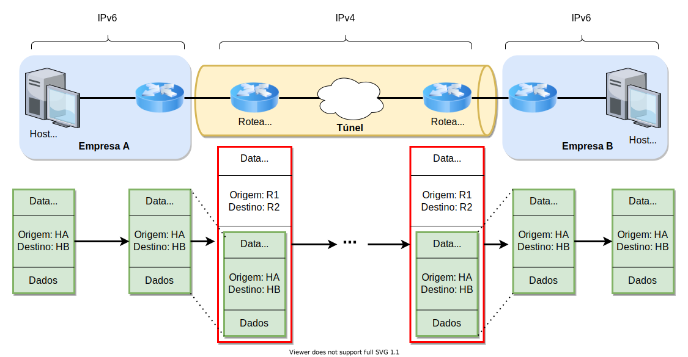
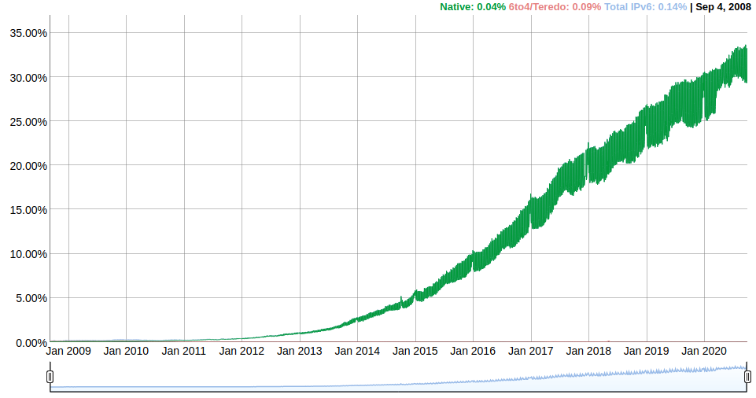

O IPv6, padronizado inicialmente na RFC 2460 de 1998, é a próxima versão
do protocolo IP, sucessora do IPv4. Embora a Internet, hoje, funcione
com o IPv4, há uma série motivos que justificam a proposta de uma nova
versão do protocolo IP.

## Motivação e Diferenças para o IPv4

A principal motivação para o IPv6 já foi discutida neste curso: a
escassez de endereços IPv4 na Internet. Para atacar isso, o IPv6 utiliza
endereços de 128 bits, bem maiores que os do IPv4. Mesmo diante das
projeções atuais de crescimento da Internet, ainda não se vislumbra um
cenário em que $2^{128}$ (um número com quase 40 algarismos
decimais) endereços sejam insuficientes.

Além disso, outra motivação era tentar fornecer um suporte mais adequado
à diferenciação de tráfego com vistas ao suporte de QoS. Para tanto, o
IPv6 aumentou o número de bits de cabeçalho que podem ser utilizados
para esse fim, além de permitir uma categorização bem mais flexível dos
datagramas em *tipos*.

Uma outra motivação importante era a simplificação do processamento do
cabeçalho. O cabeçalho IPv4 tem tamanho variável, por conta do campo de
opções --- que pode ou não estar presente e, se estiver, também
pode variar de tamanho. O processamento de cabeçalhos de tamanho
variável é mais complexo, já que é as tarefas executadas dependem de
valores que serão encontrados --- ou não --- no próprio cabeçalho.
Embora esta diferença possa parecer insignificante, para um roteador que
precisa processar centenas de milhares ou até milhões de pacotes por
segundo, qualquer redução em complexidade se torna representativa. Por
isso, o IPv6 adotou um formato de cabeçalho de tamanho fixo --- e,
portanto, de mais fácil processamento. O IPv6 ainda dá suporte a opções
similares às do IPv4, mas para isso utiliza um outro cabeçalho separado,
fazendo com que, na prática, estas opções, se existirem, sejam a carga
útil do datagrama IPv6.

Outro fator que resulta em alta complexidade nos roteadores IPv4 é a
possibilidade de fragmentação. A divisão de um datagrama original em
vários pedaços é uma tarefa custosa e, na prática, percebeu-se que ela
pode ser evitada. No próprio IPv4, a fragmentação muitas vezes não
ocorre por decisão das próprias camadas superiores. Um exemplo disso é o
TCP: para que uma possível fragmentação de segmentos não interfira em
mecanismos do TCP, como a estimativa do RTT, por exemplo, o protocolo instrui
o IP a nunca fragmentar seus segmentos. Isso é feito atribuindo o valor
$1$ a uma *flag* do cabeçalho IPv4 denominada *do not fragment*. Quando
esta *flag* é $1$ e o datagrama é maior que o MTU do enlace do próximo
salto, o roteador simplesmente descarta o datagrama.

Neste ponto, pode-se perguntar porque o TCP preferiria que seu segmento
seja descartado a ser simplesmente fragmentado --- e, neste caso,
entregue. A resposta é que, além de descartar o datagrama grande demais,
o roteador também gera uma mensagem ICMP de volta ao *host* de origem
avisando sobre o erro --- informando, inclusive, o MTU do enlace que
causou o descarte. Com isso, o TCP pode reduzir o valor do seu MSS,
gerando segmentos menores que agora respeitem o MTU do enlace
problemático. Repare que estes segmentos ainda podem ser grandes demais
para o MTU de um enlace posterior no caminho: neste caso, novamente
haverá descarte, envio da mensagem ICMP e nova redução no MSS. Em certo
momento, este processo levará o TCP a encontrar o maior valor possível
de MSS tal que os MTUs dos enlaces ao longo do caminho sejam
respeitados. Este técnica é conhecida como *Path MTU Discovery* e é
amplamente utilizada na Internet.

Levando em consideração que vários protocolos e aplicações hoje já
habilitam a *flag* *do not fragment* no IPv4 e que há uma técnica que
permite a descoberta do MTU de um caminho, o IPv6 simplesmente aboliu a
fragmentação. Datagramas IPv6 que são maiores que o MTU do próximo
enlace são simplesmente descartados e a origem é avisada do fato. Note
que esta mudança segue perfeitamente a filosofia de inteligência nas
bordas da Internet: removeu-se uma funcionalidade complexa do núcleo e a
responsabilidade de solução foi delegada às bordas.

Outras mudanças do IPv6 em relação ao IPv4 incluem:

1.  **Remoção do campo *checksum***. Outra alteração que visa a
    simplificação do processamento dos datagramas. Boa parte dos
    protocolos de camada de enlace já incluem algum tipo de mecanismo de
    verificação de integridade. Desta forma, percebeu-se que o
    *checksum* do IPv4 é muitas vezes redundante **em relação aos
    mecanismos de verificação das camadas inferiores**. Por esta razão,
    este *checksum* quase nunca é útil.

2.  **Criação do ICMPv6**. Assim como o ICMP acompanha o IPv4, o ICMPv6
    provê funcionalidades para que *hosts* e roteadores reportem erros e
    enviem outras informações em redes IPv6.

## Transição e Tunelamento

No início desse material, citamos que a primeira RFC do IPv6 data de 1998. Mesmo assim, depois
de mais de 20 anos, a Internet ainda é majoritariamente uma rede IPv4.

A razão para esta lentidão na migração para o IPv6 está na natureza
decentralizada da administração da Internet. Não é possível forçar todos
os equipamentos a migrem simultaneamente para o IPv6 porque não há uma
única entidade com autoridade administrativa sobre todos os dispositivos
conectados à Internet.

A solução, portanto, é uma migração gradual. Entretanto, é preciso levar
em conta a incompatibilidade de versões do IP: um roteador IPv4 não é
capaz de processar datagramas IPv6.

Para contornar esta dificuldade, a Internet utiliza algumas soluções de
coexistência entre IPv4 e IPv6. Uma bastante popular é baseada no
conceito de **tunelamento**.

Para entender o conceito de tunelamento, considere o seguinte cenário ilustrado na figura abaixo:

{style="max-width: 100%;"}

Suponha que as redes institucionais de duas empresas, A e B, operem
ambas sobre IPv6. Entretanto, o caminho disponível --- passando pela
Internet pública --- para encaminhar pacotes entre os roteadores de
borda de A e B inclui apenas roteadores IPv4. Se um *host* da empresa A
gera um datagrama IPv6 destinado a um *host* da empresa B, o roteador de
borda de A não pode simplesmente enviá-lo para o roteador de próximo
salto: o datagrama seria descartado pela falta de suporte ao IPv6.

Ao invés disso, quando o datagrama IPv6 chega ao roteador de borda da
empresa A, ele pode encapsular este pacote em um cabeçalho IPv4
endereçado ao endereço IPv4 do roteador de borda da empresa B. Para
todos os efeitos, o resultado deste encapsulamento é simplesmente um
datagrama IPv4, que pode ser normalmente encaminhado pelos roteadores
IPv4 intermediários.

Ao receber o datagrama IPv4 vindo da Internet pública, o roteador de
borda da empresa B verifica que a carga útil é um datagrama IPv6 e o
desencapsula. O datagrama IPv6 resultante pode, então, ser encaminhado
normalmente pela rede institucional da empresa B, até seu destinatário.

De certa forma, a situação descrita neste cenário mostra duas "ilhas" de
equipamentos IPv6 interconectadas através de uma rede puramente IPv4. O
encapsulamento do datagrama IPv6 em um IPv4 basicamente cria um túnel lógico
que esconde a real natureza do datagrama original para a rede IPv4. Ao
final deste túnel --- *i.e.*, no roteador de borda da empresa B --- o
datagrama volta a ser puramente IPv6.

## Adoção do IPv6

Embora haja mecanismos de coexistência entre IPv4 e IPv6, e embora o
IPv6 exista há duas décadas, a migração entre versões ainda se encontra
nos estágios iniciais. Estatísticas de grandes provedores de conteúdo,
como Google e Akamai, sugerem que ainda seja baixo o nível de adoção do IPv6. Por exemplo, dados disponibilizados em setembro de 2020[^AdocaoIPv6Google] pela Google com base no acesso a seus serviços colocavam a adoção do IPv6 em torno dos 30% dos seus clientes. Esse número, embora ainda relativamente baixo, configura um enorme avanço na adoção do IPv6, se comparado a dados de anos recentes, conforme ilustrado no gráfico abaixo:

{style="max-width: 100%;"}

[^AdocaoIPv6Google]: Dados atualizados podem ser vistos em <https://www.google.com/intl/pt-BR/ipv6/statistics.html#tab=ipv6-adoption>.

Existem dados também sobre o nível de adoção por cada país. Por exemplo, dados da Akamai de setembro de 2020[^AdocaoIPv6Akamai] apontavam para a Índia como o país com maior nível de adoção com 63,5. O Brasil aparecia em 13º lugar no ranking, com 36,2%. Por outro lado, há vários países com níveis bem mais baixos de adoção, inclusive dentre aqueles com alto nível de desenvolvimento econômico. Exemplos incluem a Itália (5,5%) e a Espanha (2,4%). Além disso, há vários países com níveis reportados de adoção do IPv6 muito próximos a zero. Embora os dados da Google por país variem um pouco em relação aos valores exatos, eles mostram um retrato bastante parecido.

[^AdocaoIPv6Akamai]: Dados atualizados podem ser vistos em <https://www.akamai.com/br/pt/resources/our-thinking/state-of-the-internet-report/state-of-the-internet-ipv6-adoption-visualization.jsp#countries>

Mesmo com a aceleração percebida nos últimos anos, este ritmo de migração para o IPv6 é surpreendente lento se considerarmos a enorme
evolução que as camadas superiores da pilha de protocolos TCP/IP
sofreram do final da década de 1990 para cá. Nesse período, houve o advento e popularização de uma série de aplicações outrora impensáveis, como redes sociais e serviços de
*streaming* de vídeo de alta qualidade sob-demanda. A explicação para
isso está no fato de que as migrações na camada de aplicação são muito
mais simples: se um novo protocolo de aplicação surge na Internet, basta
que cliente e servidor o implementem: a rede é apenas um canal de
comunicação que, em geral, não precisa de modificações para que a aplicação funcione. Para protocolos na camada de rede, a situação é mais difícil porque sua utilização muitas vezes depende da colaboração de várias entidades.
