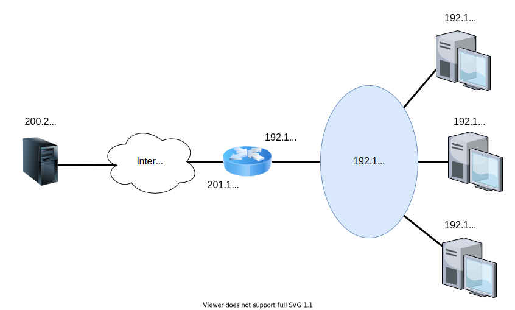

Em aulas anteriores, no contexto dos protocolos IP e DHCP, discutimos como
interfaces de rede conectadas à Internet obtêm seus endereços IP. Em
última análise, estes endereços são atribuídos pela IANA.

Ocorre, no entanto, que já há vários anos a IANA não possui mais faixas
de endereços *não reservados*[^EnderecosReservados] para alocar para os Registros Regionais de
Internet. Na verdade, quatro dos cinco RIRs do mundo também já não
possuem mais faixas disponíveis para novas alocações.

[^EnderecosReservados]: Há diversos endereços e sub-redes reservados para propósitos especiais na Internet. Ao longo dessas notas de aula, falaremos de alguns deles. Para uma lista completa, consulte <https://www.iana.org/assignments/iana-ipv4-special-registry/iana-ipv4-special-registry.xhtml>.

Este fenômeno de escassez de endereços IPv4 no mundo não é recente: há
mais de duas décadas já se projetava que isso ocorreria. Quando houve a
migração do endereçamento baseado em classes para o endereçamento CIDR,
o motivo para a projetada escassez de endereços era simplesmente a forma
ineficiente de alocação de sub-redes: faixas excessivamente grandes eram
alocadas, gerando desperdício. Hoje, no entanto, a razão é bem mais
simples: há mais dispositivos que endereços IPv4. A Cisco estima que, em
2017, aproximadamente 8 bilhões de dispositivos computacionais se
conectaram à Internet. Este número, 8 bilhões, é claramente maior que o
número máximo de endereços IPv4 distintos que se pode atribuir --- de
fato, é quase o dobro.

Este enorme número de dispositivos conectados à Internet pode parecer, a
princípio, um dado inconsistente. Se há apenas cerca de 4 bilhões de
possíveis endereços IPv4, como pode haver 8 bilhões de dispositivos se
conectando à Internet? Em primeiro lugar, deve-se ter em mente que
muitos destes dispositivos não ficam permanentemente conectados,
permitindo um *reuso de endereços*. Em segundo lugar, em qualquer dado
momento, **há um grande número de interfaces de rede conectadas à
Internet que utilizam endereços IP repetidos.**

Esta afirmação parece contradizer o que estudamos até aqui nesta
disciplina. Implicitamente, estivemos assumindo que endereços IP
deveriam ser únicos na Internet. E, de fato, isso é *geralmente*
verdade, mas há algumas exceções --- nem tão raras assim --- incluindo
o tópico destas notas de aula: a técnica NAT.

O NAT (do inglês, *Network Address Translation*) é uma técnica através
da qual um único **endereço IP público** (também chamado às vezes de
**endereço roteável**) pode ser *compartilhado* por vários dispositivos
computacionais. O termo *compartilhado* significa aqui que datagramas
originados por estes dispositivos computacionais são recebidos por
outros dispositivos na Internet pública com o campo de endereço de
origem contendo o tal endereço público.

Endereços IP privados --- em oposição aos endereços públicos --- são
aqueles compreendidos nas faixas `10.0.0.0/8`, `172.16.0.0/12` e
`192.168.0.0/16`. Estas faixas são reservadas justamente para que
usuários finais possam construir redes IPv4 privadas, com dispositivos
que não se comunicam **diretamente** com o restante da Internet, sem a
necessidade de um processo complexo de atribuição de faixas únicas de
endereçamento IP. Endereços privados não podem --- ou não deveriam ---
aparecer em tabelas de roteamento de roteadores do núcleo da Internet.
Logo, um datagrama destinado a um destes endereços passando pelo núcleo
da rede muito provavelmente será descartado por ausência de uma rota
adequada.

O fato de uma rede ser privada, no entanto, não impede que seus
dispositivos se comuniquem de forma *indireta* com os demais
equipamentos na Internet. Isso, na verdade, acontece o tempo todo na
Internet. Considere, por exemplo, um cenário de uma rede doméstica, em
que um roteador é instalado na residência para "distribuir" o acesso à
Internet a vários dispositivos computacionais, conforme ilustrado na figura abaixo:

{}

Este roteador precisa possuir ao menos duas interfaces de rede: uma interface **externa**,
através da qual ele se conecta ao ISP que provê o serviço de acesso à
Internet, e uma interface **interna**, através da qual o roteador se
comunica com os dispositivos dentro da residência.

A interface externa possui um certo endereço IP possivelmente público --- nesse exemplo, `201.17.44.67`.
No entanto, é muito comum que a interface interna esteja conectada a uma
sub-rede privada (*e.g.*, `192.168.0.0/24`). Se um *host* pertencente a
esta sub-rede privada deseja enviar um datagrama a um servidor web na
Internet pública, o roteador de borda da rede privada não pode
simplesmente executar um encaminhamento, transmitindo o pacote pelo seu
enlace externo: qualquer resposta que o servidor enviasse de volta ao
*host* se perderia no caminho, já que endereços privados não são
roteáveis na Internet pública.

A solução proposta pelo NAT é que, antes de realizar o encaminhamento do
pacote para a Internet pública, o roteador na borda da sub-rede privada
faça uma tradução de endereços. Em outras palavras, este roteador deve
substituir o endereço de origem do datagrama --- no qual consta o
endereço privado do *host* --- pelo seu endereço público. Assim,
qualquer resposta gerada pelo servidor seria corretamente encaminhada
através da Internet pública de volta até o roteador de borda.

O problema desta abordagem é que, ao receber a resposta vinda do
servidor web, o roteador de borda não teria como diferenciar este pacote
--- que deveria ser entregue ao *host* privado --- de um outro pacote
qualquer que, de fato, seja destinado ao próprio roteador. Para permitir
esta diferenciação, o NAT precisa armazenar algum tipo estado de cada
pacote encaminhado pelo roteador da sub-rede privada para a Internet
pública. Com este objetivo, o NAT utiliza uma tabela --- comumente
chamada de *tabela NAT* --- em que ele anota o **número de porta de
origem** do pacote e endereço IP privado do *host* que o
originou. Ao receber um pacote vindo da Internet, o roteador de borda
**verifica a porta de destino** --- porque, em uma resposta, a porta de
origem do pacote original se torna a porta de destino --- e consulta a
sua tabela. Caso algum mapeamento seja encontrado, o roteador entende
que se trata de um pacote direcionado a um dos *hosts* privados. Caso
contrário, assume-se que o pacote é destinado, realmente, ao roteador.

No primeiro caso, o roteador desfaz a tradução de endereços: substitui o
endereço de destino no cabeçalho IP pelo endereço privado do *host*, de
acordo com a informação encontrada na tabela NAT. Após fazer isso, o
roteador continua o processo de encaminhamento, operando sobre o
datagrama modificado.

Na prática, há mais alguns detalhes a serem considerados. Em primeiro
lugar, os mapeamentos armazenados pelo NAT na sua tabela são usados para
conexões ou fluxos de dados, e não para datagramas isolados. Isso
significa que, por exemplo, todos os pacotes de uma conexão TCP iniciada
por um *host* privado para um servidor na Internet pública utilizarão o
mesmo mapeamento. Quando o primeiro pacote da conexão passa pelo
roteador de borda da rede privada, ele consulta a tabela procurando por
um mapeamento já existente para aquela conexão. Caso não encontre, é
criado um novo mapeamento que, então, será aplicado a todos os demais
pacotes daquela conexão. Repare que isso também vale para fluxos de
pacotes UDP, ou para qualquer outro possível protocolo de transporte.

Em segundo lugar, o NAT *pode* também alterar os números de porta --- de
origem, quando o datagrama deixa a rede privada, ou de destino, quando
ele entra --- como parte do processo de tradução de endereços. Isso é
necessário porque existe a possibilidade de que dois *hosts* diferentes
na rede privada decidam estabelecer conexões com um mesmo número de
porta de origem simultaneamente. Neste caso, ao receber um pacote de
resposta da Internet pública, o roteador que realiza o NAT precisará
discernir a qual conexão --- e, portanto, a qual *host* privado ---
pertence este pacote. Logo, quando o primeiro pacote de um fluxo passa
pelo roteador de borda, o roteador cria um mapeamento incluindo, ao
menos, as seguintes três informações:

1.  **Porta original**. Número de porta conforme conhecido pelo *host*
    privado.

2.  **IP privado**. Endereço IP do *host* privado.

3.  **Porta pública**. Novo número de porta atribuído pelo roteador para
    os pacotes do fluxo correspondente.

Por fim, note que os números de porta do roteador de borda são um
recurso importante no NAT: se não houver mais números de porta não
utilizados, novas conexões ou fluxos de dados não podem ser criados da
rede privada para a Internet pública. Por este motivo, o NAT precisa de
algum mecanismo para identificar --- ou inferir --- que certos
mapeamentos podem ser removidos da sua tabela. Para conexões TCP, é
comum que o NAT monitore os segmentos de controle --- SYN, SYNACK, FIN e
FINACK --- para descobrir rapidamente quando a conexão é fechada e,
portanto, seu mapeamento não é mais necessário. Para fluxos UDP, pode-se
usar, por exemplo, um temporizador associado a cada mapeamento: se novos
pacotes não utilizarem aquele mapeamento durante um determinado
intervalo pré-configurado, o mapeamento é esquecido.

## Motivações

A escassez de endereços IPv4 na Internet é certamente a principal
motivação para a utilização do NAT. Houvesse grande oferta de endereços
IP, o NAT provavelmente seria abolido, bastando que ISPs recebessem
faixas maiores, repassando-as para as redes dos seus clientes.

Entretanto, há algumas outras potenciais vantagens no emprego do NAT.
Uma delas é a criação de uma certa *independência* no gerenciamento dos
endereços da rede privada. No caso de uma pequena empresa, por exemplo,
que muda de ISP, se cada dispositivo possuísse endereços IP públicos,
possivelmente seria necessária a reconfiguração de todos os
dispositivos, já que com o novo ISP, provavelmente mudaria a faixa de
endereços utilizada pela empresa. Ao utilizar NAT, tal modificação não é
necessária, já que basta a alteração do endereço IP público do roteador
de borda.

Há também quem argumente que o NAT serve como um mecanismo de segurança,
protegendo os equipamentos da rede privada de ataques iniciados na
Internet pública. Como os mapeamentos da tabela NAT são criados apenas
quando o primeiro pacote de um fluxo **sai da rede privada**, em geral
não é possível que um dispositivo externo *inicie* uma conexão para
dentro da rede privada. Isso força que qualquer conexão seja
necessariamente iniciada pelos *hosts* da rede privada, o que proveria
certo grau de segurança adicional.

## Análise

O NAT é amplamente empregado na Internet atual: redes domésticas quase
sempre o utilizam, e ele também é bastante popular em redes
institucionais. No entanto, o uso do NAT é bastante controverso.

Uma das questões diz respeito à organização em camadas da
Internet. **O NAT é uma técnica *cross-layer*** --- embora ele atue mais
diretamente na camada de rede, ele utiliza, e às vezes modifica,
informações da camada de transporte (o NAT, aliás, utiliza o número de
porta, um endereço da camada de transporte, como uma extensão do
endereço da camada de rede). Mecanismos *cross-layer* são muitas vezes
empregados com o propósito de otimizar certos aspectos do funcionamento
de uma rede, mas eles constituem uma violação da organização em camadas
do modelo TCP/IP. Uma das possíveis consequências negativas desta
violação é a criação de uma dependência entre implementações
particulares das camadas: o NAT só é bem sucedido se ele conhecer os
protocolos de transporte que estão sendo utilizados. Se criarmos um novo
protocolo de transporte que, em particular, coloque os campos de número
de porta em locais diferentes do seu cabeçalho, teremos também que
modificar as implementações do NAT.

Outro problema do NAT é a impossibilidade de *hosts* externos iniciarem
comunicações com *hosts* privados. Embora isso tenha sido apresentado
como uma potencial vantagem em termos de segurança na seção anterior,
esta limitação muitas vezes atrapalha o funcionamento de certas
aplicações. Em particular, o NAT geralmente funciona bem para aplicações
cliente-servidor --- assumindo que o *host* privado seja o cliente ---,
mas em aplicações P2P ele se torna problemático, impedindo que certos
pares sejam usados como servidores e, com isso, quebrando o balanço
entre demanda e oferta tão importante nesta arquitetura.

Por fim, outro argumento contrário ao uso do NAT é o de que sua
principal motivação --- a escassez de endereços IPv4 --- já possui uma
solução técnica superior: a adoção do IPv6. O IPv6 é a próxima versão do
protocolo IP --- sucessora do IPv4 --- e será discutida em algum nível
de detalhe mais a frente neste curso. Por agora, basta citar que o IPv6
introduz campos de endereço bem maiores que o IPv4, aumentando, em
muito, a quantidade de endereços disponíveis.

De toda forma, o NAT é, hoje, uma realidade na Internet. Em parte, isso
se deve ao fato desta técnica ser de fácil implantação --- ao contrário
do IPv6, como veremos adiante. Basta que se configure o roteador de
borda para realizar a tradução de endereços, algo relativamente simples.
Em teoria, um único roteador de borda, usando um único endereço IP
público, daria suporte a mais de 64 mil conexões simultâneas (já que há
$2^{16}$ portas diferentes disponíveis).

Repare, no entanto, que há também desvantagens práticas no uso do NAT.
Uma delas é o fato de que, na prática, o número de conexões simultâneas
suportadas por um roteador que realiza NAT tende a ser bem menor que as
$2^{16}$ citadas no parágrafo anterior: restrições de memória, por
exemplo, comumente limitam o tamanho máximo da tabela NAT bem abaixo
deste máximo teórico em implementações reais.

Além disso, o NAT muitas vezes possui uma interação ruim com conexões
TCP ociosas. Se um mapeamento na tabela NAT não é utilizado por algum
tempo, ele é removido sob a hipótese de que a conexão associada não
existe mais. Note que esse é um critério importante mesmo para conexões
TCP, já que é possível que, no meio de uma comunicação, os *hosts*
percam conectividade com a rede antes de trocarem os segmentos de
fechamento de conexão. Se, por outro lado, a conexão estava apenas sem
tráfego durante este período, novos segmentos transmitidos não
encontrarão o mapeamento correto ao passarem pelo roteador. Na prática,
a conexão, que até então era considerada aberta pelos dois *hosts*, será
quebrada.

## NAT *Traversal*

Como já explicado em duas ocasiões nesta aula, um dos problemas --- ou
vantagens, dependendo do ponto de vista --- do NAT é a impossibilidade
de um *host* externo iniciar uma comunicação com um *host* privado.
Infelizmente para certas aplicações, este tipo de interação é
importante. Por isso, e pela enorme popularidade do NAT hoje em dia,
este problema já foi bastante estudado, e as soluções encontradas são
genericamente denominadas de técnicas para *NAT Traversal*.

Uma solução simples para *NAT Traversal* é a inserção manual de regras
estáticas de mapeamento na tabela NAT. Suponha que uma rede doméstica
utiliza NAT para compartilhar um único endereço IP público entre vários
dispositivos. Suponha que um destes dispositivos execute um servidor web
e que desejemos permitir acesso externo (*i.e.*, vindo da Internet
pública).

Para que um *host* externo consiga abrir uma conexão TCP para a porta 80
deste servidor web, inevitavelmente ele terá que gerar um datagrama
destinado ao endereço IP público do roteador de borda. Entretanto,
quando este datagrama chegar ao roteador de borda, este consultará a sua
tabela NAT e precisará encontrar um mapeamento indicando que este
datagrama deve ser encaminhado para o endereço privado do servidor web,
mantendo-se a porta de destino como sendo a porta 80. Se, previamente,
inserirmos uma entrada estática e fixa --- *i.e.*, que não expire ---
com este mapeamento, a comunicação será bem sucedida. Este tipo de
solução muitas vezes recebe o nome de *encaminhamento de porta*, ou
*port forwarding*, em inglês.

A solução de encaminhamento de porta funciona bem para a inclusão de
mapeamentos semi-permanentes --- *i.e.*, que raramente mudam --- na
tabela NAT. Neste caso, é razoável assumir que um administrador de rede
realize esta configuração manualmente.

No entanto, em certos cenários, aplicações são executadas nos *hosts* da
rede privada de maneira mais dinâmica, potencialmente abrindo *sockets*
para escuta em portas nem sempre previsíveis. Para estes casos, uma
solução mais apropriada seria o uso de um protocolo de comunicação que
permitisse que um *host* privado solicitasse dinamicamente ao seu
roteador a inclusão de um mapeamento na tabela NAT. Um protocolo que
permite isso é o chamado IGD (do inglês, *Internet Gateway Device
Protocol*), empregado, por exemplo, por alguns aplicativos P2P.

Para que esta solução funcione é preciso que tanto a aplicação quanto o
roteador suportem o IGD. Aliás, ainda que o roteador dê suporte ao
protocolo, é preciso que este suporte esteja habilitado, o que nem
sempre é verdade. Por este motivo, uma aplicação deve estar preparada
para a possibilidade de que as duas soluções anteriores falhem. Neste caso,
outra alternativa relativamente comum na Internet é o uso da técnica de
*relaying*.

Um exemplo de aplicação P2P que utiliza *relaying* --- em último caso
--- é o Skype. Se dois dispositivos desejam estabelecer uma chamada, mas
ambos se encontram **atrás de NATs**, eles utilizam um outro par da rede
que possua um endereço IP público --- que pode, inclusive, ser um
servidor dedicado a isso --- como um intermediário. Ambos os lados da
chamada estabelecerão fluxos de dados com o intermediário. Através
destes fluxos, cada lado enviará seus pacotes que chegarão à camada de
aplicação do intermediário que fará o encaminhamento para o outro lado.

Repare que **o encaminhamento citado aqui ocorre na camada de
aplicação**. O aplicativo Skype rodando no intermediário terá *sockets*
abertos para se comunicar com cada um dos lados da chamada. O que é
recebido por um *socket*, é enviado pelo outro e vice-versa.