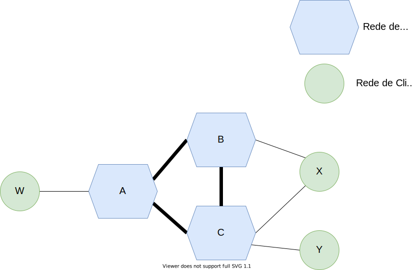

Ao contrário do roteamento Intra-AS, no roteamento Inter-AS é necessária
a padronização na escolha do protocolo de roteamento. Desta necessidade,
a Internet convergiu para o estabelecimento do BGP (*Border Gateway
Protocol*) como seu padrão para roteamento Inter-AS.

O BGP pode ser dividido em duas componentes básicas: o eBGP (*External*
BGP), responsável pela troca de informações de roteamento entre
*gateways* de Borda de ASs vizinhos, e o iBGP (*Internal BGP*),
responsável pela propagação dos anúncios de rota recebidos de um AS
vizinho para os roteadores internos do AS. Através dos anúncios
recebidos dos vizinhos, um AS é capaz de aplicar **políticas e
critérios** para escolher "boas" rotas para destinatários na Internet.
Além disso, um AS utiliza o BGP para anunciar suas sub-redes para o
resto da Internet, permitindo, assim, que estas sub-redes sejam
inseridas nas tabelas de roteamento dos roteadores do resto da Internet
e que datagramas a elas destinados possam ser encaminhados com sucesso.

No cerne do funcionamento do BGP está o conceito de **sessão BGP**. Uma
sessão BGP é apenas um jargão para denotar uma conexão TCP estabelecida
entre dois roteadores para a troca de informações de roteamento através
do BGP. Repare, portanto, que o BGP é implementado na forma de uma
aplicação rodando sobre *sockets* TCP. Cada roteador que executa o BGP
deve ser configurado para conhecer seus **pares BGP** --- *i.e.*, outros
roteadores com os quais deve estabelecer uma sessão BGP para trocar
informações de roteamento. Um exemplo típico são dois roteadores
*gateways* de borda que interconectam dois ASs vizinhos: eles
normalmente estabelecerão uma sessão BGP através da qual realizarão
anúncios um ao outro de prefixos de sub-rede para os quais cada AS é
encaminhar pacotes.

**O BGP é dito um protocolo baseado em "Vetor de Caminhos"**. O conceito
é similar ao de um protocolo baseado em Vetor de Distâncias, mas, ao
invés de enviar apenas as distâncias para cada destinatário conhecido,
uma rota BGP contém a sequência de ASs percorridos. Isso tem algumas
vantagens simples, como a possibilidade de evitar o problema de contagem
ao infinito (já que um AS facilmente poderia detectar fazer parte do
caminho anunciado pelo seu AS vizinho para um dado destinatário). No
entanto, a maior utilidade disso para o BGP está em permitir o chamado
**roteamento baseado em políticas** (explicado em detalhes mais
adiante). Note que, por outro lado, anúncios de rotas no BGP têm o
potencial de se tornarem muito grandes, dada a necessidade de listar
toda a sequência de ASs percorridos. Uma contramedida para isso é a
capacidade do BGP de agregar prefixos próximos em um mesmo anúncio de
rota, se valendo da natureza hierárquica do endereçamento na Internet.

Outra diferença do BGP para outros protocolos de roteamento estudados
até aqui é o fato de um AS não ser obrigado a anunciar todas as rotas
que conhece para seus vizinhos. De fato, como discutiremos a seguir, um
AS pode decidir não anunciar rotas para certos destinatários a um ou
mais de seus ASs vizinhos. Por outro lado, se um AS anuncia ao seu
vizinho uma rota para um determinado prefixo --- jargão do BGP para
denotar uma sub-rede --- **ele está se comprometendo a encaminhar
datagramas do seu vizinho para este prefixo**.

Quando um *gateway* de borda recebe o anúncio de uma nova rota a partir
de um AS vizinho --- o que é feito via eBGP --- ele deve propagar esta
informação para os demais roteadores do AS. Esta propagação é realizada
através do iBGP. A partir do recebimento desta informação pelo iBGP, os
demais roteadores do AS avaliam a "qualidade" desta rota e, de acordo
com vários critérios, decidem o próximo salto para o destinatário em
questão. Além disso, um outro *gateway* de borda do AS, ao receber este
anúncio via iBGP *pode* anunciar a nova rota descoberta para outro AS
vizinho.

Estes anúncios de rota no BGP carregam uma série de informações. Em
particular, uma *rota* no BGP é representada por um prefixo de sub-rede
e uma série de atributos. Um exemplo de atributo já discutido é o
chamado `AS-PATH`, que é a lista de ASs percorridos pela rota em
questão. Outro atributo importante é o `NEXT-HOP`, que armazena o
endereço IP da interface de rede através da qual um *gateway* de borda
anuncia uma rota para um AS vizinho via eBGP. Quando este anúncio é
propagado para os roteadores internos de um AS via iBGP, o atributo
mantém seu valor. Para um roteador interno, portanto, o atributo
`NEXT-HOP` **armazena o endereço IP do primeiro salto da rota externo ao
AS**. Para um roteador interno, portanto, este `NEXT-HOP` **não
corresponde ao próximo salto que constará na tabela de roteamento**. O
roteador precisará combinar esta informação com as informações do
roteamento intra-AS para, de fato, determinar a interface de saída
adequada para esta rota.

Repare que como as sessões BGP são transportadas por conexões TCP, não
há risco de perda de um anúncio --- a menos, é claro, que a conexão TCP
seja interrompida, mas neste caso os pares BGP serão avisados da falha e
poderão se recuperar de acordo. Com isso, ao contrário de protocolos de
roteamento que atuam sobre UDP ou diretamente sobre IP, não é necessário
que os anúncios de rotas sejam repetidos periodicamente sobre uma sessão
BGP. Embora isso possa não parecer uma grande vantagem, é preciso
considerar que a quantidade de prefixos anunciados em uma sessão BGP é
grande e tem aumentado rapidamente ao longo dos anos. Além disso,
lembre-se que uma rota BGP é uma informação composta por vários campos,
incluindo uma lista completa de ASs percorridos. Logo, cada prefixo
anunciado é, individualmente, grande --- ao menos em comparação com as
entradas de um Vetor de Distância em um protocolo deste tipo. Logo, não
precisar enviar todos os anúncios várias vezes ajuda a manter o
funcionamento do BGP viável na prática.

## Roteamento Baseado em Políticas

Suponha que um roteador de um AS receba múltiplos anúncios de rotas
diferentes para alcançar um mesmo prefixo. Como ele deve escolher entre
estas várias rotas disponíveis? Ao contrário dos outros protocolos
estudados anteriormente, **o BGP baseia fortemente suas decisões de
roteamento em políticas**, que nem sempre estão diretamente alinhadas
com critérios de desempenho. Estas políticas muitas vezes são
determinadas por acordos comerciais --- ou pela ausência desses. Por
exemplo, um ISP pode decidir que não é interessante para seu AS anunciar
certas rotas aos ASs vizinhos, a menos que esses façam um acordo
comercial estabelecendo algum tipo de compensação financeira pelo
tráfego encaminhado. Um AS pode, também, possuir algum tipo de restrição
por encaminhar tráfego através de algum outro AS particular da Internet
--- por exemplo, desavenças políticas podem levar ASs de um país a
querer evitar direcionar seu tráfego por ASs de outro país rival.

Voltando à questão original, quando um *gateway* de borda recebe um
anúncio de rota vindo do seu par no AS vizinho, ele utiliza estas
políticas pré-configuradas para introduzir --- ou alterar o valor de ---
um atributo numérico chamado `LOCAL_PREFERENCE`. Uma vez configurado o
valor deste atributo, o anúncio é disseminado para os demais roteadores
do AS. Quando múltiplas rotas para um mesmo prefixo são recebidas por um
roteador, o primeiro critério é justamente esse: seleciona-se a rota
associada ao maior valor de `LOCAL_PREFERENCE`.

É possível, no entanto, que haja um empate: duas ou mais rotas
apresentam o mesmo nível de `LOCAL_PREFERENCE`. Neste caso, o BGP aplica
os seguinte critérios, em ordem:

1.  **`AS-PATH` mais curto**. Escolhe-se a rota que passa pelo menor
    número de ASs. Note que, embora este critério tenha uma motivação
    ligada a desempenho (*i.e.*, minimizar o número de ASs percorridos),
    **ela não garante que a rota selecionada tenha o menor número de
    saltos**, já que o `AS-PATH` não especifica a exata sequência de
    roteadores percorridos em cada AS.

2.  **Roteador `NEXT-HOP` mais próximo**. Este é o chamado **roteamento
    batata quente**, brevemente discutido na aula anterior. Cada
    roteador do AS faz a escolha particular pela rota que tira o
    datagrama "mais rapidamente" do AS local. Para tomar esta decisão, o
    roteador utiliza as rotas encontradas pelo roteamento Intra-AS,
    comparando os custos das melhores rotas encontradas para cada um dos
    *gateways* de borda utilizados para alcançar o `NEXT-HOP` das rotas
    BGP.

3.  **Critérios adicionais**. Se todos os critérios anteriores falharem,
    as implementações do BGP ainda são flexíveis o suficiente para
    permitir uma gama de outros critérios de desempate.

O BGP utiliza também políticas para determinar se deve ou não anunciar
certas rotas para ASs vizinhos. Considere, por exemplo, a seguinte
situação, ilustrada graficamente na figura abaixo:

{style="max-width: 800px; width: 100%;"}

Suponha que uma grande instituição --- genericamente denotada na figura por X --- contrata enlaces redundantes de conexão
com a Internet com dois ISPs, B e C. Digamos que os roteadores de borda
da instituição executem BGP, estabelecendo sessões eBGP com os
*gateways* de borda dos respectivos ISPs. Suponha que através de uma das
sessões eBGP o ISP C anuncia para a instituição uma rota para um certo
prefixo Y na Internet. Assim, a instituição passa a conhecer uma rota
para a sub-rede Y através do ISP C. Se o BGP anunciasse rotas a ASs
vizinhos indiscriminadamente, a instituição anunciaria esta rota
recém-aprendida para o ISP B, correndo o risco de que B resolvesse
utilizá-la para encaminhar seus pacotes para Y.

Neste exemplo, esta situação é obviamente indesejada para a instituição:
ela contratou o ISP B para encaminhar seus pacotes, e não o contrário.
Neste caso, o administrador da rede da instituição poderia simplesmente
configurar seus roteadores de borda para aceitar anúncios de rota vindos
dos ISPs, mas não enviar rotas para eles --- exceto as rotas para as
próprias sub-redes da instituição.

Considere agora uma outra situação, também ilustrada na figura: três ISPs, A, B e C, se
interconectam (*i.e.*, há enlaces entre A e B, B e C, e C e A). Suponha
que A possua um AS cliente W. Para que W seja visível para o resto da
Internet, o AS A precisa anunciar rotas para os prefixos de W para seus
ASs vizinhos --- em particular, B e C. Uma vez que B receba este
anúncio, ele tem uma escolha: ele deve anunciar para C que sua rota para
W? Repare que se B o fizer, ele está se comprometendo a realizar o
encaminhamento de pacotes de C para W. Entretanto, qual é a motivação
para que B o faça? Estes pacotes não foram gerados pelos clientes de B e
não são destinados aos clientes de B. Logo, a menos que haja um acordo
comercial estabelecendo algum tipo de compensação por este
encaminhamento, pode ser do interesse de B não fazer este
encaminhamento, forçando C a encontrar algum caminho alternativo.

