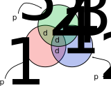

# Código de Hamming

O Código de Hamming é um método de correção de erros inventado por Richard W. Hamming na década de 1950. Esse método não foi o primeiro a permitir a correção de erros. À época, já se utilizavam, por exemplo, métodos de votação, nos quais cada bit era triplicado: o receptor/leitor determinava o valor "correto" do bit contando qual valor --- 0 ou 1 --- aparecia na maioria das três cópias. Entretanto, o Código de Hamming trouxe grandes melhorias de eficiência, tanto em termos da quantidade de bits redundantes inseridos na mensagem, quanto em termos da capacidade de detectar e corrigir eventuais erros.

A motivação Richard Hamming para a criação desse código foram os recorrentes erros no armazenamento e processamento de dados em computadores eletromecânicos da época. Esses erros eram frequentes e causavam a interrupção da execução das tarefas computacionais para correção manual do problema. Assim, um método que conseguisse não só detectar, mas também corrigir pequenas corrupções de bits significaria um grande ganho de eficiência na execução de tarefas computacionais longas.

Apesar de ter sido criado há cerca de 70 anos, o código de Hamming ainda é usado hoje, principalmente em memórias RAM com códigos corretores de erro (ECC, do inglês *error-correcting code*) --- frequentemente encontradas em servidores e outros computadores com baixa tolerância a erros. A teoria criada por Hamming para analisar as propriedades do seu código também é ainda hoje muito relevante, tendo servido de base para a criação e estudo de diversos outros códigos com aplicações atuais diversas (*e.g.*, o código de Reed-Solomon, presente em tecnologias de armazenamento óptico, em determinadas configurações de RAID e em tecnologias de comunicação como o DSL e o WiMAX).

No restante desse material, veremos como o Código de Hamming funciona, tanto do lado da codificação (*e.g.*, no transmissor), quanto do lado da decodificação (*e.g.*, no receptor). Embora haja uma teoria matemática sofisticada associada ao funcionamento e propriedades desse código, nesse material focaremos apenas na aplicação do método.

## Ideia Básica

A ideia básica do Código de Hamming é adicionar uma determinada quantidade de bits de paridade aos bits de dados. Cada bit de paridade "cobre" um subconjunto diferente dos bits de dados, ou seja, cada bit de paridade é calculado a partir dos valores de um subconjunto dos bits de dados. Esses subconjuntos, entretanto, possuem interseções entre si. Dito de outra forma, cada bit de dados participa do cálculo de mais de um bit de paridade. Assim, caso haja a corrupção de um bit de dados, teremos múltiplos bits de paridade afetados. A partir da relação dos bits de paridade afetados, podemos calcular a interseção entre os seus respectivos subconjuntos de bits de dados cobertos. Sob determinadas condições, essa interseção corresponderá a um único bit coberto por todos os bits de paridade afetados. Assim, obteremos uma boa estimativa sobre o bit corrompido.

Para entender melhor esse conceito de subconjunto de bits de dados cobertos, considere o seguinte exemplo:

{#ExemploConjuntos width=300px}

Na figura, consideramos uma mensagem composta por 4 bits de dados, denotados por $d_1$, $d_2$, $d_3$ e $d_4$. Os círculos coloridos denotam subconjuntos desses bits de dados e cada subconjunto corresponde a um bit de paridade. Por exemplo, repare que o bit $d_1$ é coberto tanto pelo subconjunto do bit de paridade $p_1$, quanto pelo subconjunto associado ao bit de paridade $p_2$. Repare ainda que cada bit de dados é coberto por ao menos dois bits de paridade --- o bit de dados $d_4$ é coberto por todos os três bits de paridade. Por outro lado, cada bit de paridade cobre três dos quatro bits de dados:

* $p_1$: cobre $d_1$, $d_2$ e $d_4$.
* $p_2$: cobre $d_1$, $d_3$ e $d_4$.
* $p_3$: cobre $d_2$, $d_3$ e $d_4$.

Durante o processo de codificação da mensagem, os três bits de paridade são computados considerando os valores de seus respectivos subconjuntos dos bits de dados. Para um esquema de paridade par, por exemplo (*i.e.*, a quantidade total de bits iguais a 1 incluindo o de paridade deve ser par), podemos calcular os valores dos bits de paridade da seguinte forma:

* $p_1 = d_1 \oplus d_2 \oplus d_4$.
* $p_2 = d_1 \oplus d_3 \oplus d_4$.
* $p_3 = d_2 \oplus d_3 \oplus d_4$.

Nessas expressões, o operador $\opĺus$ denota o *ou-exclusivo* entre dois bits.

Repare que uma corrupção no bit $d_1$ faria com que as paridades $p_1$ e $p_2$ deixassem de bater, mas não afetaria a paridade $p_3$. De um outro ponto de vista, se o receptor de uma mensagem codificada recomputar os valores das paridades com base nos bits de dados recebidos e notar valores diferentes para as paridades $p_1$ e $p_2$, ele poderá concluir que houve uma corrupção no bit de dados $d_1$, porque $d_1$ é o único bit de dados na interseção entre os conjuntos de bits de dados cobertos por $p_1$ e $p_2$. É justamente através desse tipo de análise que o Código de Hamming permite a detecção e correção de erros.

Considere novamente o esquema de paridade descrito nessa seção e responda às seguintes perguntas:

1. Suponha que, para uma mensagem específica, $d_1 = 1$, $d_2 = 1$, $d_3 = 0$ e $d_4 = 1$. Quais os valores dos bits de paridade $p_1$, $p_2$ e $p_3$?
1. Considere agora um enlace de comunicação que utilize esse mesmo esquema de codificação. Suponha que um receptor receba os seguintes valores de bits: $d_1 = 1$, $d_2 = 0$, $d_3 = 0$, $d_4 = 0$, $p_1 = 1$, $p_2 = 1$ e $p_3 = 0$. O receptor considerará a mensagem como correta? Caso não considere, ele conseguirá corrigi-la? Se sim, qual o bit corrigido?
1. Considere agora um enlace de comunicação que utilize esse mesmo esquema de codificação. Suponha que um receptor receba os seguintes valores de bits: $d_1 = 1$, $d_2 = 1$, $d_3 = 1$, $d_4 = 0$, $p_1 = 1$, $p_2 = 1$ e $p_3 = 1$. O receptor considerará a mensagem como correta? Caso não considere, ele conseguirá corrigi-la? Se sim, qual o bit corrigido?
1. Considere agora um enlace de comunicação que utilize esse mesmo esquema de codificação. Suponha que um receptor receba os seguintes valores de bits: $d_1 = 1$, $d_2 = 1$, $d_3 = 1$, $d_4 = 1$, $p_1 = 1$, $p_2 = 0$ e $p_3 = 1$. O receptor considerará a mensagem como correta? Caso não considere, ele conseguirá corrigi-la? Se sim, qual o bit corrigido?

## Determinando os Bits de Dados Cobertos

Conforme os exemplos apresentados, a codificação apresentada na seção anterior pode ser usada para detectar e corrigir determinados tipos de erros em mensagens. Entretanto, até aqui, não explicamos como aquele esquema de codificação foi obtido. Além disso, aquele esquema utilizada 3 bits de paridade para cada 4 bits de dados. Isso traz a pergunta de se é possível gerar esquemas semelhantes com outras proporções de bits de dados para bits de paridade.

O exemplo apresentado na seção anterior denota uma parametrização específica do Código de Hamming conhecida como *Hamming(7,4)*. No entanto, o Código de Hamming é um método mais genérico, que permite a geração de outros esquemas de codificação com proporções diferentes de bits de dados para bits de paridade. Nessa seção, entenderemos como tanto o Hamming(7,4), quanto outros esquemas são gerados.

Vamos considerar inicialmente a codificação Hamming(7,4). Como visto na seção anterior, ela opera sobre 4 bits de dados e adiciona 3 bits de paridade, totalizando 7 bits. Esses 7 bits são dispostos em 7 posições, numeradas de 1 a 7. As posições 1, 2 e 4 são alocadas para os bits de paridade $p_1$, $p_2$ e $p_4$, respectivamente. Já os bits de dados $d_1$, $d_2$, $d_3$ e $d_4$ são posicionados nas posições 3, 5, 6 e 7, respectivamente. Repare que os índices das posições alocadas para os bits de paridade correspondem a potências de 2, enquanto as demais posições correspondem a somas de duas ou mais potências:

* $3 = 2^0 + 2^1$.
* $5 = 2^0 + 2^2$.
* $6 = 2^1 + 2^2$.
* $7 = 2^0 + 2^1 + 2^2$.

Essa decomposição das posições dos bits de dados em potências de 2 é justamente o que determina os subconjuntos de bits associados a cada bit de paridade. Mais especificamente, o bit de dados da posição $(2^{a_1} + \dots 2^{a_k})$ pertence aos subconjuntos dos bits de paridade $p_{a_1}, \dots, p_{a_k}$.

Podemos estender esse mesmo método para outras quantidades de bits de dados e de paridade. Por exemplo, podemos definir uma codificação Hamming(15,11) na qual são usados 4 bits de paridade e 11 bits de dados, totalizando 15 bits na mensagem codificada. Os bits de paridade serão posicionados nos índices relativos às potências de 2, enquanto os bits de dados serão dispostos, em ordem, nas outras posições:

|      Posição     |    1    |    2    |      3      |    4    |      5      |      6      |        7        |    8    |      9      |      10     |        11       |      12     |        13       |        14       |          15         |
|:-----------------|:-------:|:-------:|:-----------:|:-------:|:-----------:|:-----------:|:---------------:|:-------:|:-----------:|:-----------:|:---------------:|:-----------:|:---------------:|:---------------:|:-------------------:|
|  Potências de 2  |  $2^0$  |  $2^1$  |  $2^0+2^1$  |  $2^2$  |  $2^0+2^2$  |  $2^1+2^2$  |  $2^0+2^1+2^2$  |  $2^3$  |  $2^0+2^3$  |  $2^1+2^3$  |  $2^0+2^1+2^3$  |  $2^2+2^3$  |  $2^1+2^2+2^3$  |  $2^1^2^2+2^3$  |  $2^0+2^1+2^2+2^3$  |
|     Conteúdo     |  $p_1$  |  $p_2$  |    $d_1$    |  $p_2$  |    $d_2$    |    $d_3$    |      $d_4$      |  $p_4$  |    $d_5$    |    $d_6$    |      $d_7$      |    $d_8$    |      $d_9$      |     $d_{10}$    |       $d_{11}$      |

Mais genericamente, podemos gerar um Código de Hamming para qualquer número $k > 1$ de bits de paridade. Nesse caso, o número total de bits na mensagem codificada será $2^k - 1$ --- porque podemos gerar todos os valores de 0 a $2^k - 1$ com $k$ bits, mas as posições começam a contar do 1. Assim, o número de bits de dados será $2^k - 1 - k$. Alguns exemplos de Códigos de Hamming estão listados na tabela a seguir:

|      Código      |  Tamanho da Mensagem Codificada  |  Bits de Dados  |  Bits de Paridade  |
|:-----------------|:--------------------------------:|:---------------:|:------------------:|
|   Hamming(3,1)   |                 3                |        1        |          2         |
|   Hamming(7,4)   |                 7                |        4        |          3         |
|  Hamming(15,11)  |                15                |        11       |          4         |
|  Hamming(31,26)  |                31                |        26       |          5         |

Considerando o que vimos até aqui, responda às seguintes questões:

1. Qual seria a próxima linha da tabela anterior? Isto é, qual é o número de bits de dados e o tamanho total da mensagem codificada em Código de Hamming com 6 bits de paridade?
1. Quais bits de dados são cobertos pelo bit de paridade $p_3$ no Hamming(15,11)? Quais bits de paridade cobrem o bit de dados $d_9$ no Hamming(15,11).
1. Para cada Código de Hamming na tabela anterior, qual é a **taxa de codificação**? Isto é, qual é a razão entre o número de bits de dados para o tamanho total da mensagem codificada?
1. A taxa de codificação aumenta, diminui ou permanece constante à medida que consideramos Códigos de Hamming com mais bits de paridade?

## Codificação, Verificação e Correção

Há vários algoritmos para a implementação dos passos dos procedimentos de codificação, verificação e correção para os Códigos de Hamming. Do ponto de vista da capacidade de correção, todos eles são equivalentes aos processos ilustrados na seção anterior: são apenas abstrações diferentes para entender um mesmo método. Nessa seção, discutiremos uma possível implementação que usa o conceito de *codeword*, também aplicável a outros métodos.

A ideia desse tipo de implementação é simples: pré-computamos o resultado da codificação de cada possível mensagem e armazenamos esses resultados em uma tabela. Quando é necessário codificar uma mensagem, simplesmente consultamos a entrada correspondente na tabela, obtendo imediatamente sua versão codificada --- chamada de *codeword*. Um processo análogo pode ser feito para a decodificação: pré-computamos o resultado da decodificação de todas as possíveis mensagens codificadas --- incluindo as possíveis versões corrompidas --- e armazenamos esses resultados em uma tabela.

Repare que, para uma codificação Hamming(7,4), por exemplo, existem apenas $2^4 = 16$ possíveis combinações de bits de dados que podem ser identificadas pelos valores 0 a 15. Assim, o armazenamento das *codewords* para essa codificação requer um vetor de apenas 16 posições, uma quantidade facilmente armazenável na maioria dos casos. Para o processo inverso, há um total de $2^7 = 128$ possíveis combinações de mensagens --- contabilizando as versões potencialmente corrompidas ---, o que também é bastante razoável para a maior parte dos dispositivos computacionais modernos. Para códigos mais longos, o armazenamento necessário para esse método pode se tornar inviável. Por outro lado, se armazenamento não é um problema, a grande vantagem desse método é que, uma vez que as tabelas sejam pré-computadas, codificação e decodificação são realizadas em um tempo constante equivalente ao tempo de acesso à memória.
