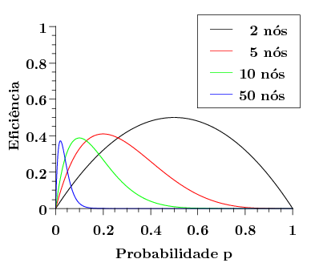

# Análise do ALOHA Baseado em *Slots*

Dentre os protocolos de acesso ao meio pertencentes à família de acesso aleatório --- também chamados de *baseados em contenção* ---, o protocolo ALOHA é um dos mais (senão o mais) antigo. Mesmo assim, esse protocolo ainda hoje é considere importante, não só por razões históricas, mas pelo seu emprego em determinadas tecnologias de comunicação modernas. Um exemplo disso é o uso do ALOHA como protocolo de acesso ao meio na tecnologia LoRaWAN, bastante empregada em soluções de IoT (*Internet of Things*, ou Internet das Coisas).

O protocolo ALOHA foi projetado como parte da ALOHAnet, uma rede de comunicação sem fio criada pela Universidade do Havaí com o objetivo de prover conectividade de usuários localizados nas diversas ilhas do arquipélago a um servidor compartilhado localizado no campus principal da universidade. A ALOHAnet entrou em operação no início da década de 1970 e é amplamente considerada a primeira demonstração pública de uma rede sem fio baseada em comutação de pacotes. Dessa forma, a ALOHAnet pode ser considerada uma precursora de tecnologias populares atualmente, como o Wi-Fi e o LTE.

O protocolo de acesso ao meio ALOHA sofreu alterações ao longo do período de desenvolvimento e operação da ALOHAnet. Em particular, hoje geralmente faz-se a distinção entre o *ALOHA Puro* e o *ALOHA baseado em Slots de Tempo* (também denominado *Slotted ALOHA*). Cronologicamente, o ALOHA Puro foi a primeira vertente. Posteriormente, o *Slotted ALOHA* foi proposto como uma versão melhorada --- embora com maior complexidade de implementação --- do ALOHA Puro.

Nesse material, estudaremos em certo nível de detalhe o funcionamento do ALOHA, com especial atenção à sua eficiência em gerenciar o uso do meio de transmissão. Em particular, focaremos majoritariamente na versão baseada em *slots*, por apresentar melhor desempenho e uma análise mais simples. Ao longo desse estudo, veremos ainda uma série de elementos e conceitos do ALOHA que se aplicam a outros protocolos de acesso aleatório.

## Funcionamento do ALOHA Baseado em *Slots*

Como o nome sugere, no *Slotted ALOHA* o tempo é discretizado em *slots*, ou janelas de tempo, de duração fixa. Cada *slot* é suficiente para a transmissão de um único quadro (por simplicidade, vamos assumir aqui que todos os quadros possuem o mesmo tamanho). Nós sempre sabem quando começam e terminam os *slots*, e transmissões sempre são iniciadas no início de *slots*. Em outras palavras: se um nó decide transmitir um quadro, mas encontra-se no meio do *slot* atual, ele necessariamente aguardará até que um novo *slot* se inicie para começar sua transmissão. Por fim, assumiremos também que se dois ou mais nós transmitem em um mesmo *slot*, sempre ocorre colisão e todos os nós envolvidos são capazes de detectá-la (note que ainda não entramos no mérito de como essa detecção é realizada).

Dadas essas características e hipóteses, o funcionamento do *Slotted*
Aloha é bastante simples. Quando um nó decide enviar um quadro, ele simplesmente aguarda o início do próximo *slot* e realiza a transmissão, independentemente de quaisquer outros fatores. Essa transmissão pode ter dois resultados:

-   **Ausência de colisão**: transmissor considera a transmissão do
    quadro correspondente encerrada. Se houver outro quadro a ser
    transmitido, ele pode iniciar a nova transmissão no início do
    próximo *slot*.

-   **Colisão**: nesse caso, o nó detectará que a colisão ocorreu e
    tentará **retransmitir** o quadro nos *slots* subsequentes como
    forma de recuperação.

Ao contrário da tentativa original de transmissão de um quadro, que sempre ocorre no início do próximo *slot* de tempo, em uma retransmissão, um nó pode demorar vários *slots* até realizar a próxima tentativa. A cada novo *slot*, o nó decide aleatoriamente se realizará a retransmissão naquele *slot* ou não. Mais especificamente, o *Slotted ALOHA* utiliza um parâmetro $p$ que determina a probabilidade de um nó decidir realizar a retransmissão no próximo *slot*. Note, portanto, que nas tentativas de retransmissão o nó pode **adiar o acesso ao meio** ---
um mecanismo conhecido como ***backoff***.

Mas por que não fazer simplesmente com que os nós tentem a retransmissão no próximo *slot* de tempo em caso de colisão? Por que é necessário --- ou, ao menos, vantajoso --- introduzir esse *backoff* aleatório? Para responder essas perguntas, consideremos um protocolo alternativo em que, em caso de colisão, o nó sempre realiza a tentativa de retransmissão no início do *slot* subsequente. Repare que, por definição, uma colisão envolve dois ou mais transmissores. Logo, todos os --- múltiplos --- transmissores que tiveram seus quadros colididos em um dado *slot*
realizarão retransmissões no *slot* seguinte. Em outras palavras, tais retransmissões se darão, necessariamente, simultaneamente. Como consequência, as retransmissões também falharão por conta de uma nova colisão.

Repare que quando uma colisão ocorre, ela implicitamente introduz uma **sincronização** nos estados dos nós envolvidos, no sentido de que todos eles terão acabado de ter seus quadros perdidos por colisão, necessitando, portanto, realizar suas respectivas retransmissões. Se todos os nós executassem as mesmas ações determinísticas nesse momento --- por exemplo, tentar retransmitir imediatamente ou tentar retransmitir daqui a 10 *slots* de tempo --- essa sincronização levaria a uma nova colisão, fazendo com que os transmissores jamais conseguissem se recuperar. É justamente para quebrar esse sincronismo que o *backoff* aleatório serve: o adiamento da retransmissão por um nó dá aos demais a oportunidade de transmitirem (sozinhos) seus quadros, enquanto a componente aleatória reduz a probabilidade de que nós diferentes agendem suas retransmissões para um mesmo *slot* de tempo novamente.

## Análise Qualitativa 

Embora simples, o *Slotted ALOHA* tem uma série de características positivas. Por exemplo, ele é altamente **eficiente sob baixas cargas**. Em um caso extremo, se apenas um transmissor possui dados a transmitir, ele obtém uma utilização de 100% do enlace já que, sem concorrência, não há colisões e, portanto, não há *backoffs*. Além disso, o protocolo é altamente **descentralizado** em termos das decisões tomadas por cada nó: um transmissor decide ou não acessar o meio com base apenas em informações locais. Por fim, a implantação do algoritmo em si é **simples**, dependendo apenas da capacidade de geração de números pseudo-aleatórios, algo relativamente comum em sistemas computacionais modernos.

Por outro lado, há também pontos negativos. Em primeiro lugar, há a **possibilidade de colisões**, especialmente sob altas cargas, o que introduz desperdício de tempo de uso do enlace, reduzindo a eficiência do protocolo. Além disso, em caso de retransmissões, *slots* podem ficar **ociosos**, mesmo que haja dados a serem transmitidos no enlace (isto é, todos os transmissores podem abrir mão de transmitir em um dado *slot* como parte de seus *backoffs*). Em termos de complexidade de implementação, a discretização do tempo em *slots* comuns a todos os transmissores demanda um certo grau de **sincronização de relógio**. Por fim, note que ainda que um nó tenha a capacidade de detectar uma colisão **durante a transmissão do quadro**, todo o *slot* será desperdiçado em caso de colisão, porque novas transmissões só podem ser começadas no início do próximo *slot*.

## Eficiência

Voltemos um instante à eficiência do *Slotted ALOHA*. Dada sua operação simples e considerando algumas simplificações razoáveis, é possível modelá-la matematicamente. Para isso, definiremos a eficiência do protocolo como a fração de *slots* **bem sucedidos a longo prazo**. Aqui, *bem sucedidos* significa que **houve uma transmissão e que não houve colisão**. Por outro lado, *a longo prazo* quer dizer que estamos considerando uma sequência arbitrariamente longa de *slots*. Para essa análise, consideraremos que existem $N$ transmissores *ativos*. Em outras palavras, esses $N$ transmissores sempre possuem quadros a enviar[^4], enquanto outros nunca transmitem.

[^4]: É comum dizermos que esses transmissores possuem um *backlog infinito*.

Da descrição do funcionamento do *Slotted ALOHA*, pode-se inferir que o protocolo possui basicamente dois estados referentes à transmissão de quadros: ou o nó está no processo de realizar a transmissão original do quadro, ou se encontra tentando realizar uma retransmissão. Note que o comportamento de um nó nesses dois estados é diferente, já que, no primeiro, a transmissão sempre é realizada no próximo *slot*, enquanto, no segundo, a transmissão é realizada no próximo *slot* com probabilidade $p$. Para simplificar a análise, consideraremos apenas o segundo caso[^5]. Em resumo: todos os $N$ nós possuem quadros a transmitir em todo *slot* e o farão com probabilidade $p$.

[^5]: Repare que em uma situação de alta carga essa hipótese se torna mais razoável, já que colisões se tornam mais comuns, fazendo com que a maioria das transmissões sejam retransmissões de quadros perdidos.

O primeiro passo nessa análise é determinar a probabilidade de que um
*slot* seja bem sucedido. Isso ocorre quando exatamente um nó transmite e os outros $N-1$ não. A probabilidade de que um dado nó transmita sozinho é dada por:

$$p\cdot \underbrace{(1-p)\cdot (1-p)\cdot \dots\cdot (1-p)}_{(N-1) \text{ vezes}} = p\cdot(1-p)^{(N-1)}$$

Note, entretanto, que como há $N$ transmissores ativos, qualquer um deles pode ser o transmissor bem sucedido no *slot* em questão. Logo, a probabilidade de que um dado *slot* seja bem sucedido é:

$$P(\text{Slot bem sucedido}) = N\cdot p\cdot(1-p)^{(N-1)}$$

A longo prazo, esse valor corresponde à eficiência do protocolo, conforme definido anteriormente:

$$\text{Efic}(p) = P(\text{Slot bem sucedido}) = N\cdot p\cdot(1-p)^{(N-1)}$$

Repare que a eficiência é, portanto, uma função de $N$ (número de transmissores ativos) e $p$ (probabilidade de retransmissão em um dado
*slot*). O valor $N$ é uma característica do enlace, mas $p$ pode, a princípio, ser configurado. Uma pergunta natural, portanto, é: **existe algum valor ótimo** de $p$?

A resposta para essa questão é "sim". Independentemente do número de transmissores ativos, a função $\text{Efic}(p)$ possui exatamente um ponto máximo, como pode ser visto na figura a seguir:

Esse gráfico mostra o comportamento da função $\text{Efic}(p)$ para diversos valores do número de transmissores $N$. Aumentar o valor de $N$ faz com que a curva seja "empurrada" para a esquerda do gráfico, mas, para todos os valores de $N$, a curva apresenta o mesmo comportamento básico: a eficiência inicialmente aumenta com o aumento de $p$, alcança um valor máximo e, a partir dali, começa a cair.

Determinar o ponto em que esse máximo ocorre é simples. Bastando calcular a primeira derivada da função em relação ao parâmetro $p$ e descobrir onde ela se torna nula:

$$\text{Efic}^\prime(p) = N\cdot (1-p)^{(N-1)} - N\cdot(N-1)\cdot(1-p)^{(N-2)}$$

Logo, queremos determinar $p$ tal que:

$$N\cdot (1-p)^{(N-1)} - N\cdot(N-1)\cdot(1-p)^{(N-2)} = 0$$

Assumindo que $N \not= 0$ e $(1-p) \not= 0$:

$$(1-p)-(N-1)\cdot p = 0$$ $$p = \frac{1}{N}$$

Isso indica que o valor ótimo de $p$ depende do número de transmissores ativos no enlace, o que faz sentido se considerarmos que, com mais transmissores ativos, cada transmissor deve ser mais conservador nas suas tentativas de acesso ao meio. Isso também é consistente com o gráfico anterior, que mostrava o ponto de máximo da função se aproximando de $p = 0$ à medida que aumentávamos o valor de $N$.

Com base nesse valor, podemos também calcular a eficiência máxima em função de $N$. Para isso, basta substituirmos o valor ótimo de $p$ em $\text{Efic}(p)$:

$$\text{MaxEfic}(N) = \text{Efic}\left(\frac{1}{N}\right) = N\cdot\frac{1}{N}\cdot\left(1 - \frac{1}{N}\right)^{(N-1)}$$
$$\text{MaxEfic}(N) = \left(1 - \frac{1}{N}\right)^{(N-1)}$$

Assim como fizemos com $\text{Efic}(p)$, podemos plotar a função $\text{MaxEfic}(N)$:

Seja pela inspeção da expressão ou desse gráfico, podemos notar que a função é **decrescente**. Ou seja, **quanto mais transmissores, menor é a eficiência máxima alcançável**. De fato, podemos analisar mais concretamente o que acontece em um enlace com um "grande número de transmissores" calculando o limite dessa função a medida que $N\to\infty$:

$$\lim_{N \to \infty} \text{MaxEfic}(N) = \lim_{N \to \infty} \left(1 - \frac{1}{N}\right)^{(N-1)} = \frac{1}{e} \approx 0,367$$

Em resumo, tudo isso significa que a eficiência do *Slotted ALOHA* --- que já é baixa para poucos transmissores ativos (*e.g.*, 50% para $N = 2$) --- cai rapidamente e tende a pouco mais de 36% à medida que mais transmissores se tornam ativos. Repare ainda que esses valores de eficiência pressupõem o uso do valor ótimo para a probabilidade $p$. Conclui-se, portanto, que a eficiência do *Slotted ALOHA* sob altas cargas é muito ruim.

## ALOHA Puro 

Lembre-se, no entanto, que o *Slotted* ALOHA é uma otimização do ALOHA Puro. Logo, deve-se esperar que o ALOHA Puro tenha eficiência ainda mais baixa! O ALOHA Puro tinha funcionamento ainda mais simples que a versão *Slotted*. Em particular, não há qualquer sincronização entre os nós, tampouco o conceito de *slots* de tempo. Quando um nó possui um quadro a transmitir, ele simplesmente efetua a transmissão imediatamente. Em caso de colisão, o nó sorteia um valor de *backoff* aleatório de um determinado intervalo. Ao final do período de *backoff*, o nó realiza a retransmissão, independentemente de quaisquer outros fatores.

Repare que há uma diferença na forma de aplicação do *backoff* nas duas versões do ALOHA: enquanto na versão *Slotted*, o tempo de backoff é uma consequência sucessivas decisões de não retransmissão em cada *slot*, a versão pura já sorteia exatamente o valor que será aguardado. Até certo ponto, as duas formas resultam em comportamentos semelhantes, embora a abordagem utilizada pelo ALOHA puro seja mais comum nos protocolos baseados em contenção mais modernos.

Em relação à eficiência, não faremos aqui uma análise matemática do ALOHA Puro, como fizemos para a versão *Slotted*. Mas, intuitivamente, note que há **mais possibilidades de colisão** na versão pura: enquanto no *Slotted* ALOHA, só podem ocorrer colisões entre quadros que começam a ser transmitidos ao mesmo tempo (*i.e.*, no início do mesmo slot), a falta de sincronização do ALOHA Puro faz com que um quadro possa agora colidir com outro cuja transmissão foi iniciada **antes ou depois** da sua. De fato, esse aumento da probabilidade de colisão acaba levando a uma piora da eficiência: uma modelagem similar à feita para o *Slotted* ALOHA revela que, para altas cargas, a eficiência do ALOHA Puro tende a apenas 18% à medida que o número de transmissores ativos cresce.