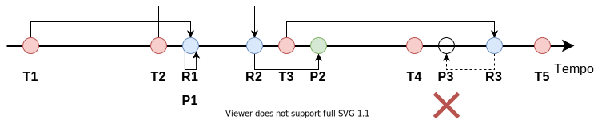
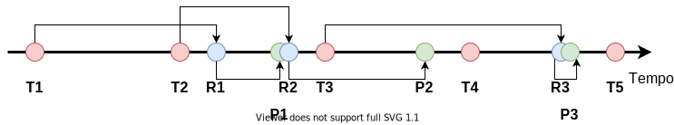

Aplicações que realizam *streaming* de conteúdo multimídia na Internet --- e em outras redes de melhor esforço --- precisam lidar com problemas como perdas de pacotes e os atrasos imprevisíveis. Embora perder um pacote possa parecer a princípio algo mais extremo, essas aplicações são igualmente afetadas pela imprevisibilidade do atraso, porque há prazos bem estabelecidos para a reprodução de cada trecho da mídia: a partir do momento que um quadro de áudio ou vídeo é reproduzido, o instante de reprodução dos demais é definido implicitamente. Assim, se um determinado pacote demora demais para chegar ao destinatário, todo o seu conteúdo pode ser considerado perdido por conta do prazo não cumprido.

Para lidar com essa imprevisibilidade do atraso introduzido pela rede, as aplicações de *streaming* geralmente empregam um atraso de reprodução --- também conhecido como *playout delay*. A ideia básica é simples: ao receber o primeiro trecho da mídia, ao invés de reproduzi-lo imediatamente, o receptor introduz um atraso artificial que funciona como uma "folga" para os pacotes subsequentes. Essa folga absorve potenciais variações no atraso ao empurrar mais para frente os prazos de reprodução dos trechos subsequentes. 

Para entender isso de forma mais concreta, considere o exemplo da seguinte figura, que mostra uma situação na qual **não é empregado um atraso de reprodução**:

{style="max-width: 800px;"}

A figura mostra uma linha de tempo de eventos de transmissão, recepção e reprodução de quadros de uma determinada mídia hipotética. Os círculos vermelhos mostram os instantes de transmissão: repare como as transmissões são igualmente espaçadas, seguindo o intervalo uniforme em que os quadros aparecem na mídia --- por exemplo, a cada 20 ms. Já os círculos azuis mostram os instantes em que cada pacote transmitido é recebido no receptor: note como o atraso de cada pacote --- correspondendo ao comprimento das setas na parte superior da figura --- varia. Nesse exemplo, o receptor decide reproduzir o primeiro quadro da mídia tão logo esse é recebido pela rede (instante marcado com o *label* **P1** na figura). Essa escolha determina o momento de reprodução do quadro seguinte (instante marcado com o *label* **P2** na figura), porque a taxa de quadros da mídia é constante --- mantendo o exemplo, a cada 20 ms. Em um primeiro momento, essa opção funciona, porque o atraso do segundo pacote é menor que o do primeiro, fazendo com que esse seja recebido antes do prazo de reprodução (instante **R2**). No entanto, o terceiro pacote sofre um atraso maior, chegando depois do prazo previsto para a reprodução. Nesse caso, o receptor fica sem dados para renderizar, o que causa o mesmo efeito que a perda do pacote teria causado.

A figura abaixo ilustra o mesmo exemplo, mas agora com a aplicação de um pequeno atraso de reprodução:

{style="max-width: 800px;"}

Note que quando o primeiro pacote (**R1**) chega ao receptor, ele não faz a reprodução imediatamente. Ao contrário, o receptor adiciona um atraso artificial (tempo entre os eventos **R1** e **P1**). Quando o segundo pacote chega (**R2**), ele também não é reproduzido imediatamente, porque o receptor deve respeitar o intervalo de reprodução entre os quadros da mídia. Assim, note como a "distância" entre os eventos de reprodução (**P1** e **P2**) é a mesma que entre os eventos de transmissão (**T1** e **T2**). A utilidade desse pequeno atraso de reprodução fica mais evidente na recepção do terceiro pacote (**R3**): ele sofre exatamente o mesmo atraso maior que havia ocorrido na figura anterior, mas, dessa vez, o prazo para reprodução desse quadro ainda não foi excedido, permitindo que o quadro não seja perdido, mesmo em face desse atraso maior.

Embora a adição de um atraso de reprodução seja importante para absorver essas variações de atraso inerentes de uma rede e melhor esforço como a Internet[^Jitter], aplicações não podem abusar desse mecanismo. Isso porque em geral há restrições em relação ao tempo máximo para a reprodução da mídia no receptor. Por exemplo, em uma aplicação de *streaming* de conteúdo **armazenado**, o usuário geralmente está disposto a aguardar algum tempo até que se forme um *buffer* razoável de reprodução. No entanto, esse tempo não é ilimitado: se mais que alguns segundos se passarem sem que a reprodução comece, o usuário provavelmente considerará esse tempo excessivo.

[^Jitter]: Lembre-se que a variação do atraso é o *jitter*, uma das quatro métricas clássicas de desempenho em redes ao lado do atraso, da perda de pacotes e da vazão.

Um atraso de reprodução de alguns segundos seria, provavelmente, suficiente para absorver as variações típicas de atraso da Internet --- onde atrasos são normalmente de, no máximo, algumas centenas de milissegundos. Entretanto, algumas aplicações são bem mais exigentes, e um atraso na casa de segundos não seria aceitável. Um exemplo são as aplicações de conversação de voz/vídeo. Nesse caso, a natureza interativa da conversação humana impõem limites de, tipicamente, 200 ms a 300 ms. Note, ainda, que esse limite não é para o valor do atraso de reprodução apenas, mas sim para o tempo total desde o momento que uma das pessoas fala até o momento em que essa fala é reproduzida do lado receptor. Isso inclui os tempos de aquisição e codificação do áudio, empacotamento, transmissão e encaminhamento do pacote pela rede, entre outros. Todos esses fatores fazem com que atrasos de reprodução nesse tipo de aplicação sejam bem restritos. Além disso, ainda que um determinado valor de atraso de reprodução seja **tolerável**, reduzir esse atraso tende a melhorar a qualidade de experiência para o usuário.

Por conta desses requisitos conflitantes --- usar um atraso de reprodução grande o suficiente para absorver a variação de atraso da rede, mas o menor possível para melhorar a interatividade ---, implementações mais sofisticadas de *softwares* de VoIP/videoconferência muitas vezes incluem mecanismos de **atraso de reprodução adaptativo**. A ideia básica é que a aplicação monitora os atrasos --- ou, mais especificamente, a variação --- sofridos pelos pacotes ao longo da comunicação para selecionar o valor mais adequado para aquele momento (lembre-se que o desempenho da rede pode variar ao longo da comunicação). Quando a aplicação nota que houve uma mudança no desempenho da rede que permita uma redução ou necessite um aumento do atraso de reprodução, a aplicação espera um momento adequado e faz a alteração.

Embora a ideia básica seja simples, há alguns complicadores para a implementação prática desse mecanismo. No restante desse documento, veremos em um pouco mais de detalhe como isso pode ser feito.

## Estimando a Variação do Atraso

O primeiro passo para configurar um atraso de reprodução adaptativo é criar uma estimativa para o nível de variabilidade do atraso dos pacotes. Isso pode ser feito através de uma média móvel do desvio do atraso de cada pacote em relação a um **ponto de referência**. Assim como feito pelo TCP, é comum o uso de uma **média móvel exponencialmente ponderada** para esse propósito. Suponha que o intervalo entre envios de pacotes subsequentes seja $\delta$. Então, podemos estimar o desvio médio do atraso através da seguinte expressão:

$$v_i = (1-\beta)\cdot v_{i-1} + \beta\cdot|r_i - r_{i-1} - \delta|,$$

onde $r_i$ e $r_{i-1}$ são, respectivamente, os instantes de tempo em que último e o penúltimo pacote foram recebidos e $v_{i-1}$ é a estimativa anterior para a variação do atraso. Além disso, ainda há a constante $0 < \beta < 1$, que controla o peso que a média dá para o histórico das amostras em relação ao peso dado para a amostra mais recente de desvio.

A ideia é atualizar a estimativa da variação do atraso a cada novo pacote recebido, comparando o intervalo entre as chegadas dos dois últimos pacotes ao intervalo de transmissão de pacotes --- o qual, assume-se, é constante. Em uma rede sem *jitter*, o intervalo entre as recepções deveria ser idêntico ao intervalo entre as transmissões, **independentemente do atraso sofrido pelos pacotes**. Como, em geral, há algum *jitter*, então esses intervalos devem destoar um pouco. Assim, a equação acima calcula uma média móvel do quanto tipicamente o intervalo de recepção destoa do intervalo de transmissão $\delta$.

Repare que a equação acima assume que não houve perda de pacotes. Caso o pacote imediatamente anterior no fluxo multimídia tenha sido perdido, o instante de tempo $r_{i-1}$ estará indefinido e a equação não pode ser computada. Há pelos menos duas formas de se lidar com isso:

1. Atualizar a estimativa do desvio médio do atraso apenas quando o pacote anterior também tiver sido recebido.
2. Utilizar a diferença entre os instantes de chegada do pacote atual e do último recebido, e subtrair disso um múltiplo apropriado de $\delta$. 

Nessa segunda alternativa, a equação pode ser reescrita como:

$$v_i = (1-\beta)\cdot v_{i-1} + \beta\cdot\frac{|r_i - r_{i-x} - x\cdot\delta|}{x},$$

onde $x - 1$ denota o número de pacotes perdidos entre o último pacote recebido e o atual.

## Atualizando o Atraso de Reprodução

Dada o valor do desvio médio do atraso --- atualizado a cada novo pacote recebido pelo receptor ---, é possível selecionar um novo valor para o atraso de reprodução. Para isso, em geral, multiplica-se o desvio médio por alguma constante $k$:

$$d_{i} = k\cdot v_i,$$

onde $d_{i}$ denota o atraso de reprodução atualizado após o recebimento do *i-ésimo* pacote do fluxo. 

A constante $k$ é selecionada de acordo com o quão conservadores queremos ser: um valor baixo de $k$ resultará em atrasos de reprodução menores, potencialmente melhorando a interatividade às custas de uma maior probabilidade de perda de quadros por atraso excessivo. Por outro lado, valores mais altos de $k$ resultam em atrasos maiores, criando uma "folga" maior no prazo de reprodução dos quadros. Isso reduz a interatividade, mas torna menos provável descartarmos quadros da mídia porque esses chegaram muito tarde.

Repare que os valores $d_{i}$ podem ser calculados --- ou atualizados --- a cada novo pacote recebido. Entretanto, não podemos efetivamente alterar o atraso de reprodução a cada novo pacote. Se fizermos isso, teremos intervalos variados entre cada quadro da mídia reproduzida no receptor. Isso causaria distorções na mídia.

Se não podemos alterar o atraso de reprodução uma vez que a mídia tenha começado a ser reproduzida, então do que adianta calcular novos valores de $d_i$ dinamicamente? A resposta está nos **períodos de silêncio**.

Aplicações de VoIP geralmente são utilizadas para conversação. A conversação humana tem por característica a alternância entre períodos de fala e períodos de silêncio. Uma otimização comum em boa parte dos *softwares* de VoIP é a detecção desses períodos de silêncio por parte do transmissor: nesse caso, durante esses períodos, o transmissor simplesmente não transmite novos pacotes, economizando banda. 

Além da economia de banda, os períodos de silêncio são também oportunidades para alterarmos o atraso de reprodução. Se, ao final de um período de silêncio queremos aumentar o atraso de reprodução, simplesmente atrasamos um pouco mais a reprodução do próximo período de fala. Por outro lado, se desejamos reduzir o atraso de reprodução, simplesmente começamos a reproduzir o próximo período de fala um pouco antes do que estava originalmente previsto.

Ao fazermos essa alteração apenas ao final de períodos de silêncio, não introduzimos nenhum tipo de distorção no áudio reproduzido, porque não alteramos o intervalo entre reproduções de dois quadros consecutivos. A única consequência prática dessa mudança é que os períodos de silêncio ficam um pouco mais curtos ou um pouco mais longos do que eles efetivamente eram do lado transmissor. Entretanto, essa diferença é normalmente tão pequena que não chega a ser perceptível para os usuários humanos. Por outro lado, essa mudança pode ter um impacto representativo para a aplicação receptora ao permitir que ela se adapte a mudanças no desempenho da rede ao longo da chamada, alcançando um bom compromisso entre a interatividade e as perdas de quadros por prazo de reprodução expirado.