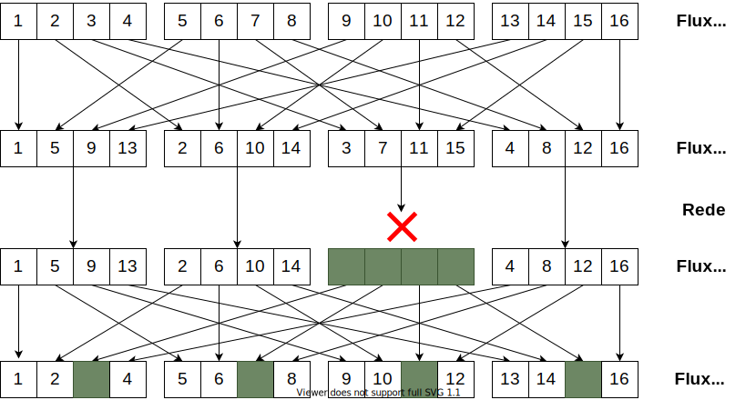

Embora boa parte das aplicações multimídia sejam tolerantes a perdas, perdas de pacotes afetam negativamente a experiência do usuário. Em outras palavras, embora a aplicação possa funcionar *bem o suficiente* para cumprir o seu propósito básico, essas perdas de pacotes reduzem a qualidade da mídia reproduzida no lado receptor. Além disso, mesmo tolerando *algum* nível de perda de pacotes, há um determinado ponto em que as perdas se tornam excessivas e a aplicação passa a não cumprir nem mesmo seu propósito básico, do ponto de vista do usuário. Dessa forma, mitigar a ocorrência e os efeitos das perdas de pacotes pode ser do interesse desse tipo de aplicação.

Ao longo do nosso estudo sobre redes de computadores, vimos duas abordagens gerais para a recuperação de pacotes/informações perdidas/corrompidas:

1. retransmissões associadas com pacotes de confirmação (*acks*);
2. métodos de FEC (*Forward Error Correction*), *i.e.*, métodos de correção de pacotes com base em bits/informações redundantes.

## Retransmissões

Embora as retransmissões sejam um método efetivo de recuperação de pacotes em diversos protocolos práticos --- notavelmente, no TCP ---, as restrições temporais das aplicações multimídia podem tornar esse mecanismo inviável. Considere, por exemplo, uma ligação VoIP entre dois usuários localizados em continentes diferentes --- digamos, um no Rio de Janeiro e outro em Canberra, na Austrália. Ainda que utilizássemos um enlace direto entre esses dois usuários passando por uma geodésica[^Geodésica], o comprimento desse enlace seria de aproximadamente 13500 quilômetros, o que resultaria em um atraso de propagação de aproximadamente $\frac{13500}{200\times 10^6} = 67,5$ ms. Isso significa que, mesmo nesse cenário idealizado, o RTT dessa comunicação seria de, no mínimo, $2\times 67,5 = 135$ ms.

[^Geodésica]: Nesse contexto, uma geodésica é a curva de menor comprimento entre dois pontos, considerando a curvatura da Terra.

Note que, na prática, esses dois usuários provavelmente não estarão conectados através de um enlace direto, mas sim através de uma rota composta por vários enlaces. O trajeto físico desses enlaces também muito provavelmente não seguirá uma geodésica --- talvez nem mesmo algo próximo disso ---, podendo envolver, inclusive, enlaces de satélite ou caminhos passando por outros continentes. Todos esses fatores fazem com que o tempo total de propagação seja substancialmente maior. Além disso, esses enlaces provavelmente seriam compartilhados com outros fluxos, o que adicionaria atrasos de enfileiramento. Por fim, estamos ainda ignorando outros tempos, como atrasos de transmissão em cada enlace, atrasos de aquisição do áudio e atrasos de processamento ao longo de todo o caminho. Em suma: é provável que esse RTT se aproxime ou ultrapasse os 250 ms.

Lembre-se que aplicações de conversação geralmente têm uma tolerância de algumas centenas de milissegundos entre o momento em que um dos lados fala alguma coisa até o momento em que essa fala é reproduzida do outro lado. Note como essa nossa estimativa de RTT no cenário de exemplo já se aproxima desse limite máximo. Assim, se um transmissor tiver que esperar por um *ack* --- ou pela sua ausência --- para perceber a perda do pacote e, então, disparar a retransmissão, essa retransmissão aconteceria ao menos[^Jitter] 250 ms depois da tentativa original. Ainda que essa segunda tentativa de transmissão chegue com sucesso ao destinatário, é possível que o pacote chegue tarde demais para ser reproduzido.

[^Jitter]: Repare que, na prática, o transmissor provavelmente aguardaria mais que os 250 ms de RTT, por causa do *jitter* da rede. Do contrário, estaríamos arriscando realizar uma série de retransmissões desnecessárias causadas por uma demora um pouco maior para a recepção do *ack*.

Por todos esses motivos, retransmissões são raramente utilizadas nesse tipo de aplicação. Uma possível exceção seriam aplicações especializadas em que se tem certeza de que os participantes da chamada estão "próximos o suficiente" para que os requisitos temporais não impeçam o uso de retransmissões.

## FEC

O mais comum, no entanto, é que retransmissões sejam consideradas inviáveis. Assim, os métodos de FEC surgem como alternativas potencialmente interessantes. Lembre-se que um método de FEC inclui bits redundantes na transmissão que permite ao receptor conseguir recuperar informações perdidas ou corrompidas de alguma forma. Esses métodos, por tanto, adicionam um pouco de *overhead* à comunicação em troca da possibilidade de recuperar dados perdidos sem retransmissões.

Quando estudamos protocolos da Camada de Enlace, vimos que esses mecanismos de FEC são frequentemente utilizados. Métodos como a Paridade Bidimensional e o Código de Hamming quebram os bits de um quadro em blocos de determinado tamanho e adicionam bits de redundância a cada um desses blocos. Ao final, os blocos aumentados com os bits de redundância são transmitidos na forma de um pacote pelo enlace. 

Essa abordagem, entretanto, não ajuda a mitigar as perdas de pacotes das aplicações multimídia, porque, na maioria das vezes, os pacotes não chegam corrompidos: eles simplesmente não são entregues ao *host* destino. Assim, introduzir bits redundantes no próprio pacote não é uma solução para o problema.

Ao invés disso, os métodos de FEC utilizados por essas aplicações **introduzem bits redundantes relativos a um pacote em outro pacote do fluxo**. Esse outro pacote pode ser um pacote adicional com o único propósito de prover redundância ou pode ser um outro pacote que carrega parte da mídia no qual anexamos bits redundantes referentes a uma parte anterior. Nas próximas seções, veremos alguns exemplos de abordagens possíveis.

### Exemplo de FEC com Pacote Redundante

Nesse método de FEC, dividimos a sequência de pacotes do fluxo multimídia em grupos de $n$ pacotes consecutivos --- $n$ é um parâmetro do método. Para cada grupo, criamos um pacote $n+1$ cujo conteúdo corresponde ao resultado da operação de *ou-exclusivo* bit-a-bit dos $n$ outros pacotes. Em outras palavras:

$$P_{n+1} = P_1 \oplus P_2 \dots \oplus P_n.$$

Para ilustrar a utilidade disso, suponha que, para um determinado fluxo, $n = 4$ e o receptor deixa de receber o terceiro pacote de um determinado grupo. No entanto, todos os demais pacotes desse grupo foram recebidos com sucesso, incluindo o pacote redundante $P_{n+1}$. Como podemos usar esse pacote redundante para recuperar $P_3$?

Isso pode ser feito observando que a operação de *ou-exclusivo* bit-a-bit é análoga a uma soma --- ou subtração --- módulo 2. Com base nisso, podemos reescrever a equação acima na seguinte forma:

$$P_3 = P_1 \oplus P_2 \oplus P_4 \oplus P_{n+1}.$$

Em outras palavras e de forma mais geral, de posse de quaisquer $n$ pacotes de um grupo, podemos calcular o pacote faltante simplesmente fazendo a operação de *ou-exclusivo* bit-a-bit entre os pacotes que possuímos. Se mais de um pacote no grupo é perdido, então o método é incapaz de recuperar as perdas.

A escolha do valor do parâmetro $n$ manipula um compromisso entre aumento do *overhead* adicionado pelo pacote redundante e o aumento da probabilidade de recuperação. No limite, se usarmos $n=1$, então cada pacote do fluxo multimídia será seguido de um pacote redundante --- nesse caso, uma cópia exatamente do único pacote do grupo. Isso representa um *overhead* de 100%, mas consegue recuperar qualquer perda que aconteça nos pacotes do fluxo, desde que o pacote redundante correspondente seja recebido. Por outro lado, ao aumentarmos o valor de $n$, reduzimos o *overhead* ao custo de tornar menos provável a recuperação de um pacote do fluxo, porque é possível que outro pacote do grupo seja perdido também.

Além disso, repare que se o primeiro pacote de um grupo é perdido, ainda que seja possível recuperá-lo, teremos que aguardar todos os demais pacotes do grupo --- incluindo o redundante. Isso significa que a própria recuperação demora algum tempo e que esse tempo cresce à medida que aumentamos o parâmetro $n$. Dadas as restrições temporais associadas a esse tipo de aplicação, valores altos de $n$ se tornam inviáveis.

### Exemplo de FEC sem Pacote Redundante

Um outro método alternativo de FEC é o envio de **versões de menor qualidade** do conteúdo de um pacote **anexadas em pacotes posteriores** --- operação muitas vezes chamada de *piggybacking*. A ideia se baseia na observação de que fluxos multimídia --- *e.g.*, áudio e vídeo --- geralmente podem ser codificados em diferentes níveis de qualidade, resultando em representações de diferentes tamanhos. Mais especificamente, em geral, quanto maior a qualidade da codificação de uma mídia, maior o tamanho resultante. 

Podemos explorar essa característica criando duas codificações de qualidades diferentes de cada trecho da mídia transmitida. Cada pacote do fluxo transportará dois trechos diferentes da mídia: o trecho atual codificado na maior qualidade e o trecho imediatamente anterior codificado na qualidade mais baixa. Caso o receptor não receba um pacote, ele ainda pode obter o trecho correspondente no pacote subsequente do fluxo. Embora esse trecho estará em uma versão de menor qualidade, reproduzi-lo é melhor que não reproduzir nada do ponto de vista da experiência do usuário.

Assim como qualquer método de FEC, este método introduz algum nível de *overhead* na comunicação ao incluir informações redundantes no fluxo de pacotes. Entretanto, com a utilização de uma codificação de menor qualidade para os trechos redundantes, conseguimos reduzir esse *overhead*. Em particular, essa relação entre as qualidades original e redundante pode ser manipulada de forma a se obter um determinado *overhead* máximo desejado.

Note também que o método descrito nos parágrafos anteriores falha no caso de dois ou mais pacotes consecutivos serem perdidos: nesse caso, apenas o último pacote da sequência perdida será recuperado quando pacote subsequente for recebido. É possível, entretanto, estender a ideia desse método para aumentar sua abrangência de recuperação. Para isso, podemos criar três ou mais versões da mídia, cada uma com uma qualidade diferente. Assim, cada pacote carregaria vários trechos: o atual, na melhor qualidade, o imediatamente anterior, em uma qualidade mais baixa, o anterior, em uma qualidade ainda mais baixa, e assim por diante. Em um esquema desse tipo com $n$ trechos por pacote, conseguiríamos recuperar até $n-1$ perdas de pacotes consecutivas, ao custo de um aumento no *overhead*.

Por outro lado, deve-se notar também que as mesmas restrições relacionadas ao tempo de recuperação citadas na seção anterior se aplicam aqui: não adianta crescer esse número $n$ de trechos carregados em cada pacote arbitrariamente porque, em certo ponto, se torna tarde demais para recuperarmos um pacote perdido, considerando o seu prazo de reprodução.

### Interleaving

Encerraremos esse material discutindo uma terceira abordagem para mitigação de perdas de pacotes em fluxos multimídia. A rigor, essa abordagem --- denominada *interleaving* --- **não é um método de FEC**, porque ela não é capaz de recuperar o conteúdo dos pacotes perdidos, nem mesmo em uma versão de mais baixa qualidade. Ao invés disso, o que o *interleaving* alcança é um mascaramento desses episódios de perda.

A ideia do *interleaving* é "dissolver" os efeitos da perda de um pacote, espalhando-os por um período mais longo. Para isso, o transmissor quebra os trechos transportados em cada pacote em pedaços menores. Por exemplo, digamos que cada pacote carregue trechos de 20 ms de áudio. Podemos subdividir cada um desses trechos em unidades menores de 5 ms. Ou seja, cada pacote carregará 4 unidades. Mas ao invés de cada pacote transportar cinco unidades consecutivas, essas unidades são espalhadas por vários pacotes diferentes, como exemplificado na figura abaixo:

{style="max-width: 800px; width: 100%;"}

A figura mostra quatro trechos de 20 ms de um fluxo de áudio, cada um dos quais subdivididos em 4 unidades menores de 5 ms cada. Ao invés de encapsular cada trecho de 20 ms consecutivos em um pacote, essas unidades menores são embaralhadas --- deterministicamente ---. Mais especificamente, a primeira unidade de cada trecho é colocada no primeiro pacote; a segunda unidade de cada trecho é colocada no segundo pacote; a terceira unidade de cada trecho é colocada no terceiro pacote; e a quarta unidade de cada trecho é colocada no quarto pacote. Esses pacotes são transmitidos pela rede e, nesse exemplo hipotético, o terceiro pacote é perdido. Os pacotes que são efetivamente recebidos tem seus conteúdos reorganizados pelo receptor, que monta, da melhor forma possível o fluxo original. 

Essa remontagem não é perfeita por conta da perda do terceiro pacote, mas note que essa perda é "espalhada" pelos quatro trechos de 20 ms. Assim, o áudio reproduzido terá alguns instantes de falha, mas serão pequenos subtrechos não consecutivos de 5 ms. Em geral, isso produz um áudio com uma qualidade superior, em relação à alternativa de um trecho completo de 20 ms faltando.

Assim como em todos os outros métodos, o *interleaving* traz alguns compromissos. Repare, por exemplo, que no cenário ilustrado na figura acima o transmissor teve que capturar 4 trechos de 20 ms de áudio --- 80 ms no total --- antes de poder transmitir o primeiro pacote, porque cada pacote carrega unidades de cada um desses 4 trechos. Esse tempo de espera para que o último trecho necessário seja capturado é mais um atraso que compõe o tempo total entre a aquisição do áudio e sua reprodução no receptor. Assim como para os demais métodos, a utilização ou não do *interleaving* e sua parametrização adequada (*i.e.*, número de trechos e subtrechos em cada pacote) dependem de uma correta avaliação de se esse atraso total de reprodução ainda será baixo o suficiente para garantir uma boa interação entre os interlocutores.

