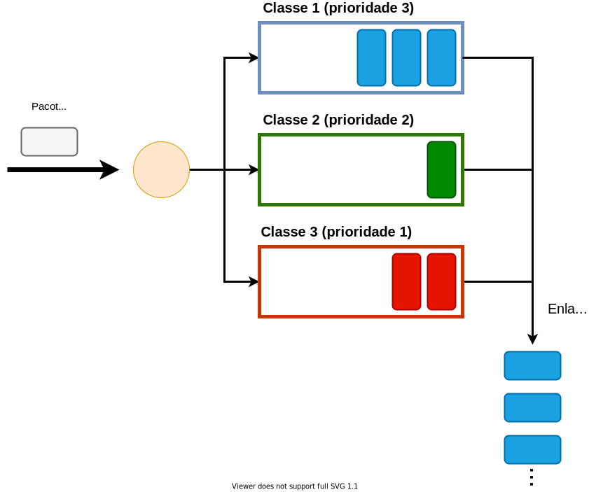
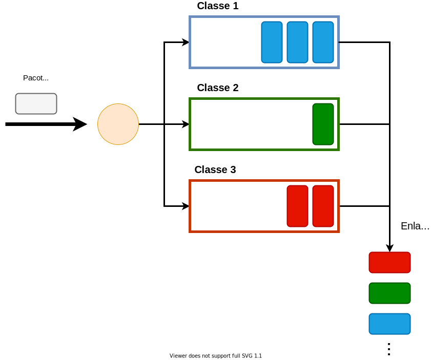
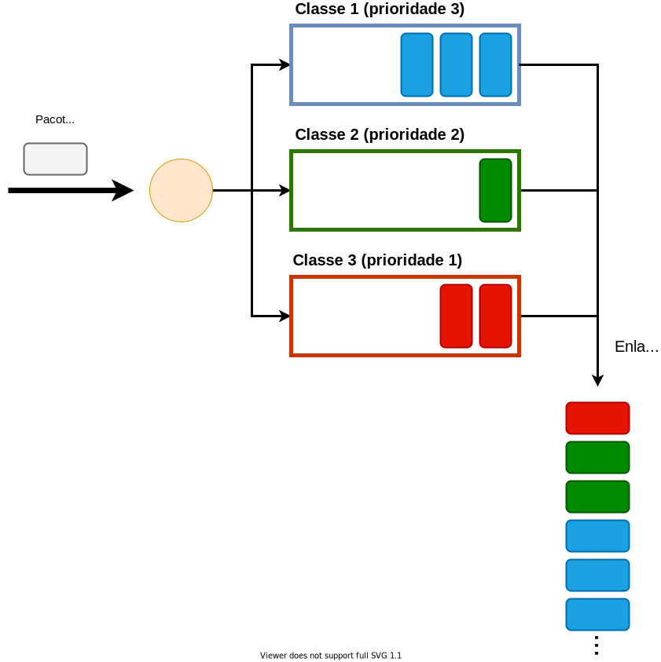

Como parte do processo de encaminhamento de um pacote por um roteador, é comum que o pacote precise ser enfileirado até que o enlace de saída se torne disponível para transmissão. De fato, roteadores na Internet estão a todo momento gerenciando as filas de pacotes associadas a cada um dos seus enlaces. Esse gerenciamento contempla duas tarefas básicas:

- **Escalonamento**: quando o enlace se torna ocioso, decidir qual dos pacotes enfileirados será o próximo a ser transmitido.
- **Descarte**: quando a fila está cheia e um novo pacote deve ser encaminhado pelo enlace correspondente, decidir qual pacote será descartado.

Embora haja opções óbvias para como escolher os pacotes em ambos os casos, essas escolhas nem sempre são as melhores possíveis. Além disso, a forma pela qual um roteador gerencia suas filas tem impacto representativo no desempenho e comportamento da rede. Isso é particularmente relevante quando tentamos fornecer algum nível específico de qualidade de serviço a um ou mais fluxos. Por esses motivos, nesse material cobriremos algumas possíveis políticas --- também chamadas de *disciplinas* --- de enfileiramento e discutiremos seus potenciais benefícios e problemas. Em particular, nos focaremos nas políticas de escalonamento e seus impactos em fluxos multimídia.

## A Política FIFO

Normalmente, quando pensamos no gerenciamento de uma fila por um roteador, a política que naturalmente nos vem a mente é a FIFO (*First-In First-Out*). Em outras palavras,
assumimos que os pacotes entram no final da fila e sempre o primeiro
pacote da fila é escolhido para a próxima transmissão.

A política FIFO é, de fato, a mais comum e popular na Internet. Ela é
simples e tende a dar oportunidades iguais a todos os pacotes, por
respeitar a ordem na qual eles chegam ao roteador. Entretanto, em certas
situações, o emprego de outras políticas de escalonamento pode trazer
benefícios. Se temos, por exemplo, fluxos de melhor esforço (*e.g.*,
fluxos TCP relativos a aplicações de transferência de arquivos)
competindo com fluxos de tempo-real (*e.g.*, uma chamada VoIP), pode ser
do interesse da rede que os pacotes da chamada VoIP "passem à frente" na
fila. Do contrário, se o volume do tráfego de melhor esforço cresce, é possível que os fluxos de tempo real comecem a sofrer atrasos excessivos.

## Políticas baseadas em Diferenciação de Tráfego

Para implementar este tipo de funcionalidade, é preciso que o roteador
seja capaz de **diferenciar** os pacotes de acordo com seus fluxos ou,
ao menos, em classes de importância. Neste caso, antes de chegar à fila
propriamente dita, o pacote passa por um elemento chamado de
**classificador**. Classificadores podem analisar uma série de características de cada pacote para classificá-los, como o protocolo de transporte, os números de porta e até outras propriedades, como tamanho. O fato é que uma vez classificados os pacotes, políticas
de escalonamento cientes de prioridades podem ser utilizadas.

### A Política *Priority Queueing*

O exemplo mais simples de uma política deste tipo é a *Priority
Queueing*. Esta política aloca *buffers* separados para cada classe, conforme exemplifica a figura abaixo:

{style="width: 700px; max-width: 100%;"}

Quando um pacote chega à fila ele é colocado no final do
*buffer* da sua classe específica. Cada classe possui uma prioridade e,
quando o próximo pacote a ser transmitido deve ser escolhido, a
*priority queueing* percorre os *buffers* da classe de maior prioridade
para a de menor prioridade: se houver um pacote no *buffer* da classe de
maior prioridade, este é escolhido para transmissão; caso contrário,
consulta-se o *buffer* da próxima classe com a maior prioridade entre as
restantes.

No exemplo da figura acima, a fila da mais alta prioridade é a da classe 1. No instante ilustrado na figura, essa classe ainda possui pacotes na fila. Assim, na próxima oportunidade de transmissão, o primeiro pacote da fila da classe 1 será selecionado. De fato, como há três pacotes atualmente nessa fila, ao menos as três próximas oportunidades de transmissão serão dedicadas à classe 1. Por outro lado, se a fila dessa classe estivesse vazia, a próxima oportunidade seria dada ao primeiro pacote da fila da classe 2.

Nota-se, portanto, que, enquanto houver pacotes nos *buffers* das
classes de maior prioridade, as classes de menor prioridade não serão
servidas. Isso efetivamente atinge o efeito desejado de deixar certos
pacotes "furarem fila". Por outro lado, pacotes de mais baixa prioridade
podem ser preteridos indefinidamente, uma situação chamada de
*starvation* (esfomeação ou inanição em português).

### A Política *Round-Robin*

O *starvation* pode ser combatido com outra política de escalonamento: a
*round-robin*, ilustrada na figura abaixo:

{style="width: 700px; max-width: 100%;"}

Assim como na política *priority queueing*, pacotes são
divididos em classes e cada classe possui seu próprio *buffer*. Quando o
próximo pacote a ser transmitido precisa ser escolhido, a política
*Round-Robin* percorre as filas em ordem, **a partir da fila logo após
aquela da qual o último pacote transmitido foi tirado**. Em outras
palavras, a cada nova oportunidade de transmissão, a política
*round-robin* dá chance para uma nova classe e esse processo é repetido ciclicamente. Por exemplo, olhando para os últimos pacotes que foram transmitidos pelo enlace na figura acima, vemos que os três últimos foram, na ordem, os das classes 1, 2 e 3. Assim, na próxima oportunidade de transmissão, o *Round-Robin* buscará o primeiro pacote da fila da classe 1. Embora não seja o caso nesse exemplo, se a fila da classe 1 estivesse vazia, o *Round-Robin* daria a oportunidade para a classe 2.

Isso significa que todas as classes receberão serviço, independentemente do que ocorre nas
demais. Embora a política *round-robin* não gere *starvation*, ela também não fornece nenhum tipo de prioridade a uma classe sobre outra --- ao
contrário, ela garante que os recursos dedicados a uma classe não
interferirão com os recursos das demais classes, seja espaço em
*buffer*, seja tempo de transmissão. Em particular, no caso do tempo de transmissão, cada classe recebe uma fração igual à das demais.

### A Política *Weighted-Fair Queueing*

Uma política que consegue, simultaneamente, garantir priorização de classes e evitar *starvation* é
a *Weighted-Fair Queueing* (ou WFQ). Um exemplo do uso dessa política é mostrado abaixo:

{style="width: 700px; max-width: 100%;"}

A WFQ atribui prioridades numéricas que são proporcionais à fração do tempo de utilização do enlace que será dedicada a cada classe. No exemplo, existem três classes com prioridades 3, 2 e 1. Classes de maior prioridade terão acesso a uma fração maior do tempo de uso do enlace. Por outro lado, classes de
prioridade mais baixa ainda receberão *alguma* fração não-nula de tempo
para utilizar o enlace, independentemente da ocupação dos *buffers* das
classes de mais alta prioridade.

Uma forma de implementar[^Simplificação] a WFQ com pesos inteiros positivos é fazer uma ligeira alteração em como a política *round-robin* opera. Assim como na *round-robin*, as filas das várias classes são percorridas ciclicamente à medida que o enlace se torna disponível para transmissão. Entretanto, ao invés de transmitir um único pacote de uma classe e passar para a próxima, o WFQ transmite $w$ pacotes da classe atual antes de passar para a seguinte, onde $w$ é o valor do peso atribuído. Esse comportamento pode ser visto na figura, observando-se os últimos pacotes transmitidos pelo enlace: foram transmitidos três pacotes da classe 1 (de prioridade 3), dois pacotes da classe 2 (de prioridade 2) e um pacote da classe 3 (de prioridade 1). 

[^Simplificação]: Nessa descrição, estamos fazendo uma simplificação implícita de que todos os pacotes são do mesmo tamanho e, portanto, levam o mesmo tempo para serem transmitidos. Em redes IP, isso não necessariamente é verdade. Assim, implementações práticas do WFQ geralmente se preocupam com a quantidade de bytes transmitidas, e não com o número de pacotes em si.

Considerando o instante de tempo mostrado na figura e os estados atuais das filas, o próximo pacote selecionado para transmissão será o primeiro pacote da fila da classe 1, porque um ciclo completo foi encerrado nos últimos pacotes transmitidos. Na verdade, como a prioridade dessa classe é 3 e já há nesse instante três pacotes na fila, então os três próximos pacotes serão certamente selecionados dessa fila. Por outro lado, note que a próxima fila de mais alta prioridade --- a fila da classe 2 --- possui uma prioridade de 2. Mas no momento mostrado na figura, há apenas um pacote na fila. Se essa situação se mantiver por mais algum tempo, é possível que a fila fique vazia quando o WFQ tentar dar a segunda oportunidade de transmissão a essa classe. Nesse caso, ao invés de deixar o recurso --- o enlace, nesse caso --- ocioso, o WFQ passará para a próxima classe, assim como feito no *Round-Robin*.

Nessa implementação, uma classe $A$ que tenha sido configurada com peso $w_A$ receberá uma fração $\frac{w_A}{W}$, onde $W$ denota o somatório dos pesos de todas as classes. Essa capacidade de prover serviços diferenciados a cada classe de pacotes --- em termos da reserva de uma fração configurável do tempo de transmissão (e, portanto, da banda) do enlace --- ao mesmo tempo em que garante que fluxos não sofrerão esfomeação torna a WFQ uma opção bastante interessante para a configuração de políticas de qualidade de serviço em redes. De fato, é possível provar matematicamente que o uso do WFQ em conjunto com métodos de condicionamento de fluxos --- como o *token bucket* --- nos permitem garantir um atraso máximo fim-a-fim para cada pacote.